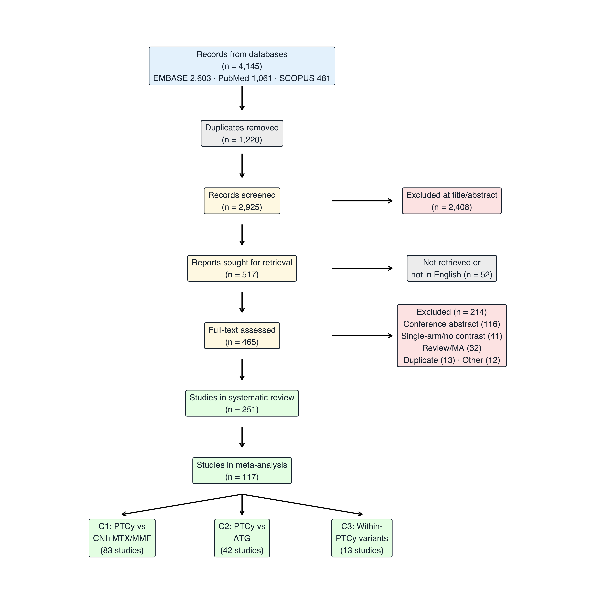
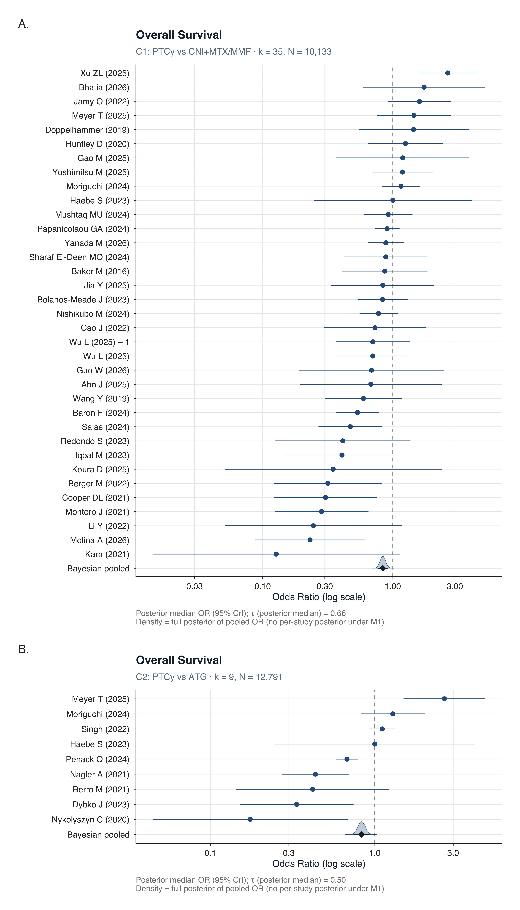
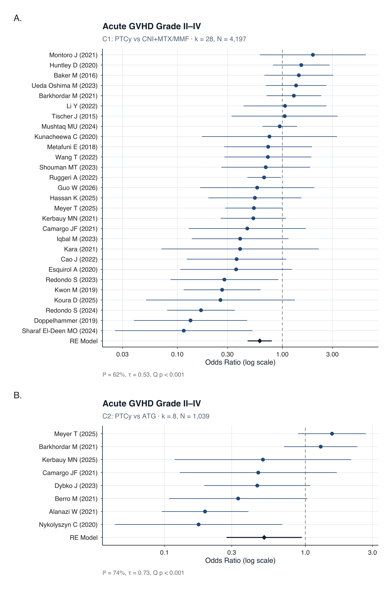
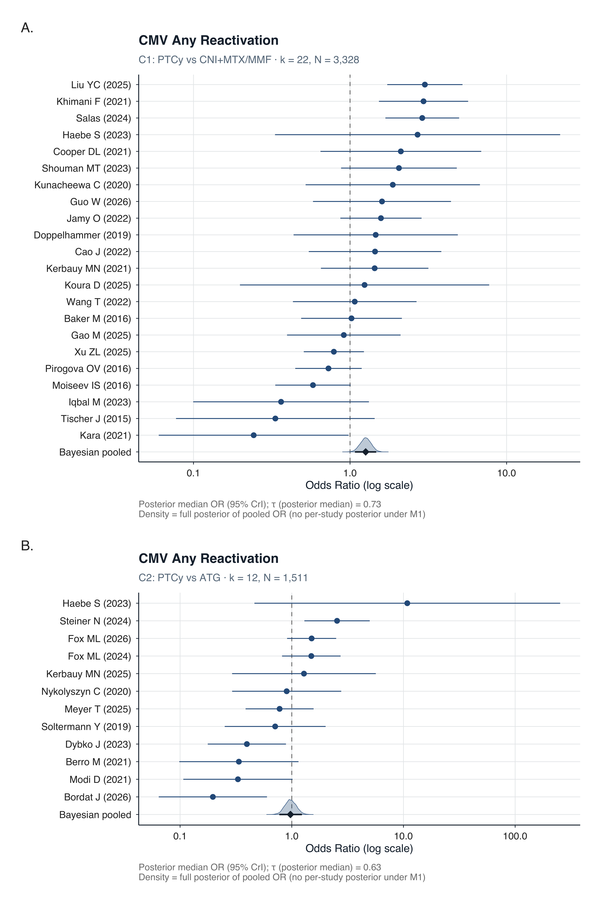
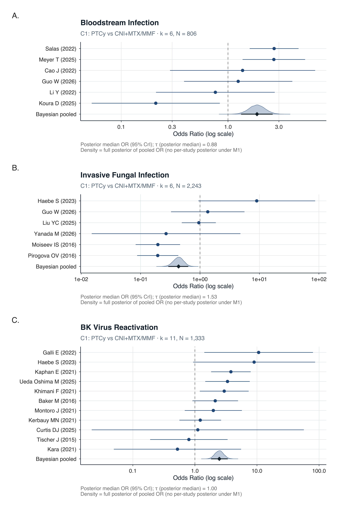
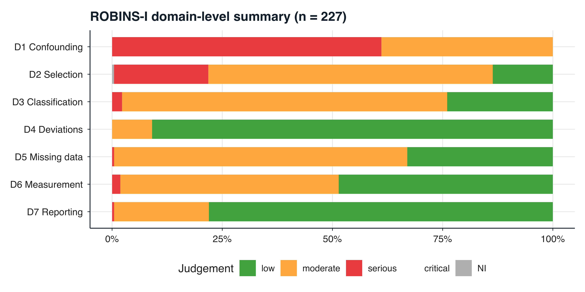

::: {.cell}

:::


*Russell Lewis MD*
*Department of Molecular Medicine, University of Padova, Padova, Italy*

---

## Summary

**Background**
Post-transplant cyclophosphamide (PTCy) is increasingly used for graft-versus-host disease (GVHD) prophylaxis after allogeneic haematopoietic stem-cell transplantation (allo-HSCT), but its effects on infection outcomes relative to alternative prophylaxis platforms have not been systematically quantified. We aimed to simultaneously evaluate survival, GVHD, and infection outcomes of PTCy across multiple comparator contexts.

**Methods**
In this systematic review and Bayesian meta-analysis, we searched EMBASE, PubMed, and SCOPUS from database inception to [search date] for studies comparing PTCy-based GVHD prophylaxis with alternative regimens in adult allo-HSCT recipients. We defined three pre-specified comparisons: PTCy versus calcineurin inhibitor (CNI)+methotrexate/mycophenolate (Comparison 1 [C1]); PTCy versus anti-thymocyte globulin (ATG; Comparison 2 [C2]); and within-PTCy regimen variants (Comparison 3 [C3]). The primary outcome was overall survival (OS). Secondary outcomes included non-relapse mortality (NRM), acute GVHD grade II–IV, CMV reactivation, bloodstream infection (BSI), and invasive fungal infection (IFI). We used Bayesian random-effects binomial-logistic models with a GVHD-mediation analysis (steroid exposure as mediator). This study is registered with PROSPERO, [CRD number].

**Findings**
Of 4145 records identified, 251 studies (525 arms; 177 758 patients; 14 RCTs) were included in the systematic review and 117 contributed to the meta-analysis. In C1 (83 studies), PTCy was associated with improved OS (OR 0·84 [95% CrI 0·76–0·92]), reduced acute GVHD (0·67 [0·59–0·78]), but increased CMV reactivation (1·26 [1·07–1·47]) and BSI (1·87 [1·33–2·62]). In C2 (42 studies), PTCy improved OS versus ATG (0·83 [0·75–0·92]) with no CMV excess (0·97 [0·77–1·23]). The CMV signal was steroid-independent and strengthened in post-2020 and haploidentical-dominant cohorts. GRADE certainty was LOW for survival and GVHD outcomes; VERY LOW for infection outcomes.

**Interpretation**
PTCy improves survival and reduces GVHD across comparator platforms, but increases CMV and bacterial infection risk relative to less T-cell-depleting regimens. The comparative pattern — CMV harm versus CNI-based but not versus ATG-based prophylaxis — indicates that infection risk tracks the depth of T-cell depletion across platforms, reframing PTCy-associated infections as a class effect of T-cell-depleting prophylaxis rather than a PTCy-specific limitation.

**Funding**
[Source of funding, or "There was no funding source for this study".]

---

## Research in Context

### Evidence before this study

We searched PubMed for systematic reviews and meta-analyses of post-transplant cyclophosphamide in allogeneic haematopoietic stem-cell transplantation published from database inception to June 1, 2026, using the terms "post-transplant cyclophosphamide" AND ("meta-analysis" OR "systematic review"). We identified seven comparative meta-analyses (Gagelmann 2019, Arcuri 2019, Arcuri 2021, Tang 2023, Luo 2024, Li 2025, Jin 2025), encompassing 6–20 studies each. All evaluated survival and GVHD outcomes; only two (Tang 2023, Li 2025) pooled any infection outcome, each with 2–4 studies per infection type. No prior meta-analysis simultaneously evaluated CMV, bacterial, and fungal infections alongside survival and GVHD. No prior study compared PTCy against both CNI-based and ATG-based comparators in a unified framework.

### Added value of this study

This systematic review and meta-analysis is, to our knowledge, the largest to date (251 studies, 177 758 patients). It is the first to systematically pool CMV, bloodstream infection, and invasive fungal infection alongside GVHD and survival within the same analytic framework. Its dual-comparator design reveals that PTCy's effect on CMV reverses direction depending on the comparator's own T-cell depletion depth — harmful versus CNI-based (OR 1·26) but null versus ATG-based (OR 0·97) — establishing a T-cell depletion hierarchy. Bayesian mediation analysis indicates that the survival benefit is not detectable independently of GVHD suppression once steroid exposure is accounted for.

### Implications of all the available evidence

PTCy improves overall survival and reduces GVHD regardless of comparator platform. Its infection costs — elevated CMV and bacteraemia — are attributable to T-cell depletion depth and are shared with ATG-based regimens. Clinical strategies should target T-cell reconstitution rather than PTCy avoidance. Within-PTCy regimen variants show no detectable differences, supporting clinical flexibility.

---

## Introduction

Post-transplant cyclophosphamide (PTCy) has transformed the practice of allogeneic haematopoietic stem-cell transplantation (allo-HSCT) by enabling safe transplantation across HLA barriers and simplifying graft-versus-host disease (GVHD) prophylaxis.^1^ Originally developed for haploidentical transplantation,^2^ PTCy is now widely used across all donor types,^3^ and the BMT CTN 1703 randomised controlled trial (RCT) established its superiority over conventional calcineurin inhibitor (CNI)-based prophylaxis for GVHD-free, relapse-free survival.^4^

Despite this evidence, uncertainty persists regarding PTCy's effects on infection outcomes. Registry and single-centre studies have variably reported increased cytomegalovirus (CMV) reactivation,^5^ elevated bacterial bloodstream infections,^6^ and comparable or reduced fungal infections^7^ with PTCy-based regimens. These findings have been difficult to synthesise because prior meta-analyses have been restricted to single comparisons, limited to 6–20 studies, and have rarely included infection as a primary outcome.

The absence of a unified analytic framework spanning multiple comparator contexts has obscured a fundamental question: are infection risks attributable to PTCy itself, or to the depth of T-cell depletion inherent to any intensive GVHD prophylaxis platform? We conducted a systematic review and Bayesian meta-analysis to simultaneously evaluate survival, GVHD, and infection outcomes of PTCy-based GVHD prophylaxis across three pre-specified comparisons, with a GVHD-mediation analysis to decompose the pathways through which PTCy influences clinical outcomes.

---

## Methods

### Search strategy and selection criteria

This systematic review and meta-analysis was conducted in accordance with PRISMA 2020 guidelines and registered with PROSPERO ([CRD number]). We searched EMBASE, PubMed, and SCOPUS from database inception to [date] for studies comparing PTCy-based GVHD prophylaxis with alternative regimens in adult (≥18 years) allo-HSCT recipients. The complete search strategy is provided in the appendix (p XX). Conference abstracts were excluded. We defined three pre-specified comparisons: C1, PTCy (±CNI/mycophenolate mofetil [MMF]) versus CNI+methotrexate (MTX)/MMF without ATG or T-cell depletion; C2, PTCy versus ATG-based prophylaxis; C3, within-PTCy regimen variants.

One reviewer (RL) screened titles and abstracts using Coevidence and conducted data extraction. AI-assisted extraction (Posit Assistant, version 2026.06) was used to accelerate data extraction from PDF source documents; all AI-extracted values were manually verified against source publications. Risk of bias was assessed using ROBINS-I for observational studies and RoB 2 for RCTs.

### Outcomes

The primary outcome was overall survival (OS). Secondary outcomes included non-relapse mortality (NRM), acute GVHD grade II–IV (at day +100), chronic GVHD (moderate–severe), CMV reactivation (any), bloodstream infection (BSI, any pathogen), invasive fungal infection (IFI, any), relapse-related mortality (RRM), BK virus reactivation, and infection-related mortality (IRM).

### Data analysis

We fitted Bayesian random-effects binomial-logistic regression models using brms (version 2.23.0) with an rstan backend. The primary model (M1) estimated the PTCy treatment effect adjusted for timepoint with a random intercept for study. Weakly informative priors were specified: N(0, 2·5) on fixed effects, N(0, 1·5) on the intercept, and Student-t(3, 0, 1) on the between-study standard deviation (τ). The GVHD-mediation model (M2) added arm-level systemic steroid exposure percentage as a covariate. Pre-specified sensitivity analyses included restriction to post-2020 publications and haploidentical-dominant cohorts. Frequentist random-effects models (REML, metafor version 5.0.1) were fitted as concordance checks. Full model specifications are in the appendix (p XX).

Where several publications reported on the same patient cohort, only one was allowed to contribute to any given outcome, selected from a pre-specified cohort-override registry recording which publication is primary for which outcome. This rule was applied after an audit showed that permitting outcome-specific ("partial") primary publications had allowed up to five publications from a single registry cohort to enter the same model as independent studies (appendix p XX). Estimates reported here reflect the deduplicated analysis.

---

## Results

### Study selection


::: {.cell}
::: {.cell-output-display}
{#fig-prisma width=2400}
:::
:::


The database search identified 4145 records (EMBASE 2603, PubMed 1061, SCOPUS 481), of which 1220 were duplicates (@fig-prisma). After screening 2925 titles and abstracts, 517 articles were sought for full-text review; 52 could not be retrieved or were not in English. Of 465 full-text articles assessed, 214 were excluded (appendix p XX), leaving 251 studies for the systematic review. Of these, 117 studies with extractable event counts contributed to the meta-analysis: C1 (83 studies), C2 (42 studies), and C3 (13 studies).

### Study characteristics


::: {#tbl-characteristics .cell tbl-cap='Table 1: Characteristics of included studies'}
::: {.cell-output-display}
`````{=html}
<table class="table table-striped table-condensed" style="font-size: 11px; width: auto !important; margin-left: auto; margin-right: auto;">
 <thead>
  <tr>
   <th style="text-align:left;"> Characteristic </th>
   <th style="text-align:left;"> PTCy arms (n=272) </th>
   <th style="text-align:left;"> Comparator arms (n=248) </th>
  </tr>
 </thead>
<tbody>
  <tr>
   <td style="text-align:left;"> Patients per arm, median (IQR) </td>
   <td style="text-align:left;"> 99.0 (46.0–211.8) </td>
   <td style="text-align:left;"> 119.5 (50.8–375.0) </td>
  </tr>
  <tr>
   <td style="text-align:left;"> Age, years, median (IQR) </td>
   <td style="text-align:left;"> 52.0 (44.9–58.0) </td>
   <td style="text-align:left;"> 53.0 (43.0–57.9) </td>
  </tr>
  <tr>
   <td style="text-align:left;"> Male, % </td>
   <td style="text-align:left;"> 57.1 (54.0–61.5) </td>
   <td style="text-align:left;"> 57.4 (53.0–61.8) </td>
  </tr>
  <tr>
   <td style="text-align:left;"> **Donor type (predominant)** </td>
   <td style="text-align:left;">  </td>
   <td style="text-align:left;">  </td>
  </tr>
  <tr>
   <td style="text-align:left;"> Haploidentical </td>
   <td style="text-align:left;"> 127 (47%) </td>
   <td style="text-align:left;"> 36 (15%) </td>
  </tr>
  <tr>
   <td style="text-align:left;"> MUD (10/10) </td>
   <td style="text-align:left;"> 64 (24%) </td>
   <td style="text-align:left;"> 94 (38%) </td>
  </tr>
  <tr>
   <td style="text-align:left;"> MSD </td>
   <td style="text-align:left;"> 29 (11%) </td>
   <td style="text-align:left;"> 54 (22%) </td>
  </tr>
  <tr>
   <td style="text-align:left;"> **Conditioning (predominant)** </td>
   <td style="text-align:left;">  </td>
   <td style="text-align:left;">  </td>
  </tr>
  <tr>
   <td style="text-align:left;"> RIC </td>
   <td style="text-align:left;"> 110 (40%) </td>
   <td style="text-align:left;"> 85 (34%) </td>
  </tr>
  <tr>
   <td style="text-align:left;"> MAC </td>
   <td style="text-align:left;"> 106 (39%) </td>
   <td style="text-align:left;"> 119 (48%) </td>
  </tr>
  <tr>
   <td style="text-align:left;"> **Graft source (predominant)** </td>
   <td style="text-align:left;">  </td>
   <td style="text-align:left;">  </td>
  </tr>
  <tr>
   <td style="text-align:left;"> PBSC </td>
   <td style="text-align:left;"> 204 (75%) </td>
   <td style="text-align:left;"> 181 (73%) </td>
  </tr>
  <tr>
   <td style="text-align:left;"> BM </td>
   <td style="text-align:left;"> 31 (11%) </td>
   <td style="text-align:left;"> 11 (4%) </td>
  </tr>
  <tr>
   <td style="text-align:left;"> **Immunological** </td>
   <td style="text-align:left;">  </td>
   <td style="text-align:left;">  </td>
  </tr>
  <tr>
   <td style="text-align:left;"> CMV R+, % </td>
   <td style="text-align:left;"> 74.8 (65.8–80.1) </td>
   <td style="text-align:left;"> 69.4 (59.5–81.3) </td>
  </tr>
  <tr>
   <td style="text-align:left;"> Steroid exposure, % </td>
   <td style="text-align:left;"> 26.6 (20.0–32.7) </td>
   <td style="text-align:left;"> 34.5 (28.5–43.5) </td>
  </tr>
</tbody>
</table>

`````
:::
:::


The 225 comparative studies encompassed 520 arms and 177 758 patients. Most were retrospective cohorts (132 [59%]) or registry analyses (62 [28%]); 14 (6%) were RCTs. PTCy arms were predominantly haploidentical donor transplants (47%) whereas comparator arms were predominantly matched unrelated (38%) or matched sibling (22%) donor transplants (@tbl-characteristics).

### Risk of bias

Of 227 observational studies assessed with ROBINS-I, 150 (66%) were at moderate risk of bias and 71 (31%) at serious risk (appendix p XX). Of 14 RCTs assessed with RoB 2, 11 had some concerns, two were at high risk, and one was at low risk.

### Comparison 1: PTCy versus CNI+MTX/MMF

#### Survival outcomes


::: {.cell}
::: {.cell-output-display}
{#fig-forest-os width=2400}
:::
:::


PTCy was associated with improved OS (k=35, OR 0·84 [95% CrI 0·76–0·92]; P(OR<1)=100%; @fig-forest-os). Adjusting for steroid exposure abolished the association (M2 OR 1·04 [0·89–1·22]), indicating that the survival advantage is not separable from GVHD suppression: no steroid-independent survival benefit was detectable. NRM showed a non-significant trend toward benefit (k=12, OR 0·88 [0·66–1·18]). Relapse-related mortality was reduced (k=34, OR 0·87 [0·77–0·97]).

#### GVHD outcomes


::: {.cell}
::: {.cell-output-display}
{#fig-forest-agvhd width=2400}
:::
:::


Acute GVHD grade II–IV was substantially reduced (k=28, OR 0·67 [0·59–0·78]). Moderate-to-severe chronic GVHD was also reduced (k=19, OR 0·47 [0·38–0·57]). This estimate is substantially weaker than the previously reported 0·33: the earlier analytic dataset was not generated by the audited pipeline and included two studies ineligible under the cohort-selection rule, whose removal alone accounts for the shift (appendix p XX).

#### Infection outcomes


::: {.cell}
::: {.cell-output-display}
{#fig-forest-cmv width=2400}
:::
:::


CMV reactivation was increased in C1 (k=22, OR 1·26 [1·07–1·47]; @fig-forest-cmv). This effect was steroid-independent (M2 OR 1·25 [1·01–1·54]) and strengthened in sensitivity analyses (appendix p XX). BSI was elevated (k=6, OR 1·87 [1·33–2·62]), BK virus reactivation showed the largest infection effect (k=11, OR 2·48 [1·82–3·38]), and IFI was reduced (k=6, OR 0·43 [0·29–0·63]), though with extreme heterogeneity (τ=1·64) (@fig-forest-infections). Infection-related mortality was not significantly increased (k=13, OR 1·19 [1·00–1·43]).


::: {.cell}
::: {.cell-output-display}
{#fig-forest-infections width=2400}
:::
:::


### Comparison 2: PTCy versus ATG

PTCy improved OS versus ATG (k=9, OR 0·83 [0·75–0·92]; @fig-forest-os), with negligible steroid-mediated attenuation (M2 OR 0·81 [0·70–0·93]). Acute GVHD was reduced (k=8, OR 0·63 [0·47–0·83]). CMV reactivation was not significantly different (k=12, OR 0·97 [0·77–1·23]; @fig-forest-cmv), contrasting with the excess seen in C1. Infection-related mortality was not increased (k=7, OR 0·90 [0·74–1·09]).

### Comparison 3: within-PTCy variants

No significant differences were detected between PTCy-based regimen variants for any outcome (OS 1·11, NRM 0·96, acute GVHD 1·00, chronic GVHD 0·67; all CrIs crossed the null; k=4–7).

### Summary of all results


::: {#tbl-results .cell tbl-cap='Table 2: Bayesian meta-analysis results — all outcomes by comparison'}
::: {.cell-output-display}
`````{=html}
<table class="table table-striped table-condensed" style="font-size: 10px; width: auto !important; margin-left: auto; margin-right: auto;">
 <thead>
  <tr>
   <th style="text-align:left;"> Outcome </th>
   <th style="text-align:left;"> Comparison </th>
   <th style="text-align:left;"> Model </th>
   <th style="text-align:right;"> k </th>
   <th style="text-align:right;"> N </th>
   <th style="text-align:left;"> OR [95% CrI] </th>
   <th style="text-align:left;"> τ </th>
   <th style="text-align:left;"> GRADE </th>
  </tr>
 </thead>
<tbody>
  <tr grouplength="12"><td colspan="8" style="border-bottom: 1px solid;"><strong>Survival and mortality</strong></td></tr>
<tr>
   <td style="text-align:left;padding-left: 2em;" indentlevel="1"> Non-relapse mortality </td>
   <td style="text-align:left;"> C1 </td>
   <td style="text-align:left;"> m1 </td>
   <td style="text-align:right;"> 12 </td>
   <td style="text-align:right;"> 1309 </td>
   <td style="text-align:left;"> 0.88 [0.66–1.18] </td>
   <td style="text-align:left;"> 0.72 </td>
   <td style="text-align:left;"> V. LOW </td>
  </tr>
  <tr>
   <td style="text-align:left;padding-left: 2em;" indentlevel="1"> Non-relapse mortality </td>
   <td style="text-align:left;"> C1 </td>
   <td style="text-align:left;"> m2_steroid </td>
   <td style="text-align:right;"> 12 </td>
   <td style="text-align:right;"> 1309 </td>
   <td style="text-align:left;"> 0.90 [0.59–1.36] </td>
   <td style="text-align:left;"> 0.60 </td>
   <td style="text-align:left;"> V. LOW </td>
  </tr>
  <tr>
   <td style="text-align:left;padding-left: 2em;" indentlevel="1"> Non-relapse mortality </td>
   <td style="text-align:left;"> C3 </td>
   <td style="text-align:left;"> m1 </td>
   <td style="text-align:right;"> 5 </td>
   <td style="text-align:right;"> 2529 </td>
   <td style="text-align:left;"> 0.96 [0.74–1.24] </td>
   <td style="text-align:left;"> 1.22 </td>
   <td style="text-align:left;"> NA </td>
  </tr>
  <tr>
   <td style="text-align:left;padding-left: 2em;" indentlevel="1"> Overall survival </td>
   <td style="text-align:left;"> C1 </td>
   <td style="text-align:left;"> m1 </td>
   <td style="text-align:right;"> 35 </td>
   <td style="text-align:right;"> 10133 </td>
   <td style="text-align:left;"> 0.84 [0.76–0.92] </td>
   <td style="text-align:left;"> 0.66 </td>
   <td style="text-align:left;"> LOW </td>
  </tr>
  <tr>
   <td style="text-align:left;padding-left: 2em;" indentlevel="1"> Overall survival </td>
   <td style="text-align:left;"> C1 </td>
   <td style="text-align:left;"> m2_steroid </td>
   <td style="text-align:right;"> 28 </td>
   <td style="text-align:right;"> 10133 </td>
   <td style="text-align:left;"> 1.04 [0.89–1.22] </td>
   <td style="text-align:left;"> 0.60 </td>
   <td style="text-align:left;"> LOW </td>
  </tr>
  <tr>
   <td style="text-align:left;padding-left: 2em;" indentlevel="1"> Overall survival </td>
   <td style="text-align:left;"> C2 </td>
   <td style="text-align:left;"> m1 </td>
   <td style="text-align:right;"> 9 </td>
   <td style="text-align:right;"> 12791 </td>
   <td style="text-align:left;"> 0.83 [0.75–0.92] </td>
   <td style="text-align:left;"> 0.50 </td>
   <td style="text-align:left;"> LOW </td>
  </tr>
  <tr>
   <td style="text-align:left;padding-left: 2em;" indentlevel="1"> Overall survival </td>
   <td style="text-align:left;"> C2 </td>
   <td style="text-align:left;"> m2_steroid </td>
   <td style="text-align:right;"> 8 </td>
   <td style="text-align:right;"> 12791 </td>
   <td style="text-align:left;"> 0.81 [0.70–0.93] </td>
   <td style="text-align:left;"> 0.67 </td>
   <td style="text-align:left;"> LOW </td>
  </tr>
  <tr>
   <td style="text-align:left;padding-left: 2em;" indentlevel="1"> Overall survival </td>
   <td style="text-align:left;"> C3 </td>
   <td style="text-align:left;"> m1 </td>
   <td style="text-align:right;"> 6 </td>
   <td style="text-align:right;"> 4746 </td>
   <td style="text-align:left;"> 1.11 [0.95–1.30] </td>
   <td style="text-align:left;"> 0.92 </td>
   <td style="text-align:left;"> NA </td>
  </tr>
  <tr>
   <td style="text-align:left;padding-left: 2em;" indentlevel="1"> Relapse-related mortality </td>
   <td style="text-align:left;"> C1 </td>
   <td style="text-align:left;"> m1 </td>
   <td style="text-align:right;"> 34 </td>
   <td style="text-align:right;"> 11121 </td>
   <td style="text-align:left;"> 0.86 [0.77–0.97] </td>
   <td style="text-align:left;"> 0.47 </td>
   <td style="text-align:left;"> NA </td>
  </tr>
  <tr>
   <td style="text-align:left;padding-left: 2em;" indentlevel="1"> Relapse-related mortality </td>
   <td style="text-align:left;"> C1 </td>
   <td style="text-align:left;"> m2_steroid </td>
   <td style="text-align:right;"> 27 </td>
   <td style="text-align:right;"> 11121 </td>
   <td style="text-align:left;"> 0.85 [0.73–0.99] </td>
   <td style="text-align:left;"> 0.55 </td>
   <td style="text-align:left;"> NA </td>
  </tr>
  <tr>
   <td style="text-align:left;padding-left: 2em;" indentlevel="1"> Relapse-related mortality </td>
   <td style="text-align:left;"> C2 </td>
   <td style="text-align:left;"> m1 </td>
   <td style="text-align:right;"> 10 </td>
   <td style="text-align:right;"> 17182 </td>
   <td style="text-align:left;"> 0.79 [0.69–0.89] </td>
   <td style="text-align:left;"> 0.16 </td>
   <td style="text-align:left;"> NA </td>
  </tr>
  <tr>
   <td style="text-align:left;padding-left: 2em;" indentlevel="1"> Relapse-related mortality </td>
   <td style="text-align:left;"> C3 </td>
   <td style="text-align:left;"> m1 </td>
   <td style="text-align:right;"> 6 </td>
   <td style="text-align:right;"> 692 </td>
   <td style="text-align:left;"> 0.80 [0.50–1.27] </td>
   <td style="text-align:left;"> 0.39 </td>
   <td style="text-align:left;"> NA </td>
  </tr>
  <tr grouplength="6"><td colspan="8" style="border-bottom: 1px solid;"><strong>GVHD</strong></td></tr>
<tr>
   <td style="text-align:left;padding-left: 2em;" indentlevel="1"> Acute GVHD II–IV </td>
   <td style="text-align:left;"> C1 </td>
   <td style="text-align:left;"> m1 </td>
   <td style="text-align:right;"> 28 </td>
   <td style="text-align:right;"> 4197 </td>
   <td style="text-align:left;"> 0.67 [0.59–0.78] </td>
   <td style="text-align:left;"> 0.68 </td>
   <td style="text-align:left;"> LOW </td>
  </tr>
  <tr>
   <td style="text-align:left;padding-left: 2em;" indentlevel="1"> Acute GVHD II–IV </td>
   <td style="text-align:left;"> C2 </td>
   <td style="text-align:left;"> m1 </td>
   <td style="text-align:right;"> 8 </td>
   <td style="text-align:right;"> 1039 </td>
   <td style="text-align:left;"> 0.63 [0.47–0.83] </td>
   <td style="text-align:left;"> 0.53 </td>
   <td style="text-align:left;"> LOW </td>
  </tr>
  <tr>
   <td style="text-align:left;padding-left: 2em;" indentlevel="1"> Acute GVHD II–IV </td>
   <td style="text-align:left;"> C3 </td>
   <td style="text-align:left;"> m1 </td>
   <td style="text-align:right;"> 7 </td>
   <td style="text-align:right;"> 2450 </td>
   <td style="text-align:left;"> 1.00 [0.80–1.25] </td>
   <td style="text-align:left;"> 0.82 </td>
   <td style="text-align:left;"> NA </td>
  </tr>
  <tr>
   <td style="text-align:left;padding-left: 2em;" indentlevel="1"> Chronic GVHD any </td>
   <td style="text-align:left;"> C1 </td>
   <td style="text-align:left;"> m1 </td>
   <td style="text-align:right;"> 8 </td>
   <td style="text-align:right;"> 1732 </td>
   <td style="text-align:left;"> 0.23 [0.18–0.30] </td>
   <td style="text-align:left;"> 0.52 </td>
   <td style="text-align:left;"> NA </td>
  </tr>
  <tr>
   <td style="text-align:left;padding-left: 2em;" indentlevel="1"> Chronic GVHD mod–severe </td>
   <td style="text-align:left;"> C1 </td>
   <td style="text-align:left;"> m1 </td>
   <td style="text-align:right;"> 19 </td>
   <td style="text-align:right;"> 2840 </td>
   <td style="text-align:left;"> 0.47 [0.38–0.57] </td>
   <td style="text-align:left;"> 0.77 </td>
   <td style="text-align:left;"> NA </td>
  </tr>
  <tr>
   <td style="text-align:left;padding-left: 2em;" indentlevel="1"> Chronic GVHD mod–severe </td>
   <td style="text-align:left;"> C2 </td>
   <td style="text-align:left;"> m1 </td>
   <td style="text-align:right;"> 6 </td>
   <td style="text-align:right;"> 905 </td>
   <td style="text-align:left;"> 0.79 [0.55–1.14] </td>
   <td style="text-align:left;"> 0.89 </td>
   <td style="text-align:left;"> NA </td>
  </tr>
  <tr grouplength="11"><td colspan="8" style="border-bottom: 1px solid;"><strong>Infection</strong></td></tr>
<tr>
   <td style="text-align:left;padding-left: 2em;" indentlevel="1"> BK virus </td>
   <td style="text-align:left;"> C1 </td>
   <td style="text-align:left;"> m1 </td>
   <td style="text-align:right;"> 11 </td>
   <td style="text-align:right;"> 1333 </td>
   <td style="text-align:left;"> 2.48 [1.82–3.38] </td>
   <td style="text-align:left;"> 1.06 </td>
   <td style="text-align:left;"> NA </td>
  </tr>
  <tr>
   <td style="text-align:left;padding-left: 2em;" indentlevel="1"> BK virus </td>
   <td style="text-align:left;"> C2 </td>
   <td style="text-align:left;"> m1 </td>
   <td style="text-align:right;"> 3 </td>
   <td style="text-align:right;"> 313 </td>
   <td style="text-align:left;"> 2.44 [1.40–4.26] </td>
   <td style="text-align:left;"> 0.57 </td>
   <td style="text-align:left;"> NA </td>
  </tr>
  <tr>
   <td style="text-align:left;padding-left: 2em;" indentlevel="1"> Bloodstream infection </td>
   <td style="text-align:left;"> C1 </td>
   <td style="text-align:left;"> m1 </td>
   <td style="text-align:right;"> 6 </td>
   <td style="text-align:right;"> 806 </td>
   <td style="text-align:left;"> 1.87 [1.33–2.62] </td>
   <td style="text-align:left;"> 0.96 </td>
   <td style="text-align:left;"> V. LOW </td>
  </tr>
  <tr>
   <td style="text-align:left;padding-left: 2em;" indentlevel="1"> cgvhd </td>
   <td style="text-align:left;"> C3 </td>
   <td style="text-align:left;"> m1 </td>
   <td style="text-align:right;"> 4 </td>
   <td style="text-align:right;"> 383 </td>
   <td style="text-align:left;"> 0.67 [0.39–1.14] </td>
   <td style="text-align:left;"> 0.41 </td>
   <td style="text-align:left;"> NA </td>
  </tr>
  <tr>
   <td style="text-align:left;padding-left: 2em;" indentlevel="1"> CMV reactivation </td>
   <td style="text-align:left;"> C1 </td>
   <td style="text-align:left;"> m1 </td>
   <td style="text-align:right;"> 22 </td>
   <td style="text-align:right;"> 3328 </td>
   <td style="text-align:left;"> 1.26 [1.07–1.47] </td>
   <td style="text-align:left;"> 0.74 </td>
   <td style="text-align:left;"> LOW </td>
  </tr>
  <tr>
   <td style="text-align:left;padding-left: 2em;" indentlevel="1"> CMV reactivation </td>
   <td style="text-align:left;"> C1 </td>
   <td style="text-align:left;"> m2_steroid </td>
   <td style="text-align:right;"> 22 </td>
   <td style="text-align:right;"> 3328 </td>
   <td style="text-align:left;"> 1.25 [1.01–1.54] </td>
   <td style="text-align:left;"> 0.76 </td>
   <td style="text-align:left;"> LOW </td>
  </tr>
  <tr>
   <td style="text-align:left;padding-left: 2em;" indentlevel="1"> CMV reactivation </td>
   <td style="text-align:left;"> C2 </td>
   <td style="text-align:left;"> m1 </td>
   <td style="text-align:right;"> 12 </td>
   <td style="text-align:right;"> 1511 </td>
   <td style="text-align:left;"> 0.97 [0.77–1.23] </td>
   <td style="text-align:left;"> 0.63 </td>
   <td style="text-align:left;"> V. LOW </td>
  </tr>
  <tr>
   <td style="text-align:left;padding-left: 2em;" indentlevel="1"> CMV reactivation </td>
   <td style="text-align:left;"> C2 </td>
   <td style="text-align:left;"> m2_steroid </td>
   <td style="text-align:right;"> 12 </td>
   <td style="text-align:right;"> 1511 </td>
   <td style="text-align:left;"> 1.00 [0.79–1.26] </td>
   <td style="text-align:left;"> 0.72 </td>
   <td style="text-align:left;"> V. LOW </td>
  </tr>
  <tr>
   <td style="text-align:left;padding-left: 2em;" indentlevel="1"> Invasive fungal infection </td>
   <td style="text-align:left;"> C1 </td>
   <td style="text-align:left;"> m1 </td>
   <td style="text-align:right;"> 6 </td>
   <td style="text-align:right;"> 2243 </td>
   <td style="text-align:left;"> 0.43 [0.29–0.63] </td>
   <td style="text-align:left;"> 1.64 </td>
   <td style="text-align:left;"> V. LOW </td>
  </tr>
  <tr>
   <td style="text-align:left;padding-left: 2em;" indentlevel="1"> Infection-related mortality </td>
   <td style="text-align:left;"> C1 </td>
   <td style="text-align:left;"> m1 </td>
   <td style="text-align:right;"> 13 </td>
   <td style="text-align:right;"> 5504 </td>
   <td style="text-align:left;"> 1.19 [1.00–1.43] </td>
   <td style="text-align:left;"> 0.82 </td>
   <td style="text-align:left;"> NA </td>
  </tr>
  <tr>
   <td style="text-align:left;padding-left: 2em;" indentlevel="1"> Infection-related mortality </td>
   <td style="text-align:left;"> C2 </td>
   <td style="text-align:left;"> m1 </td>
   <td style="text-align:right;"> 7 </td>
   <td style="text-align:right;"> 13346 </td>
   <td style="text-align:left;"> 0.90 [0.74–1.09] </td>
   <td style="text-align:left;"> 0.58 </td>
   <td style="text-align:left;"> NA </td>
  </tr>
</tbody>
</table>

`````
:::
:::


---

## Discussion

This systematic review and meta-analysis — encompassing 251 studies, 525 arms, and over 177 000 patients — is, to our knowledge, the largest and most comprehensive evaluation of PTCy-based GVHD prophylaxis to date. Its dual-comparator design and simultaneous analysis of survival, GVHD, and infection outcomes within a unified Bayesian framework enables a mechanistic interpretation that has not been possible in prior single-comparison reviews.

The survival and GVHD findings are unequivocal in direction and consistent across comparators. PTCy reduces acute GVHD grade II–IV by approximately one-third versus CNI+MTX/MMF (OR 0·67) and versus ATG (OR 0·63). Overall survival is improved by approximately 15–20% in both comparisons (C1 OR 0·84; C2 OR 0·83). These findings align with and substantially extend the BMT CTN 1703 RCT,^4^ confirming that this advantage generalises across donor types, conditioning regimens, and geographic settings.

The central conceptual contribution of this analysis is the resolution of apparently contradictory infection findings into a coherent mechanistic framework. PTCy administered on days +3 and +4 post-transplant eliminates alloreactive T cells (the intended GVHD-preventive effect) but simultaneously depletes the nascent pathogen-specific T-cell repertoire (an unintended immunological cost). In C1, this manifests as increased CMV reactivation (OR 1·26) and BSI (OR 1·87). Neither is attenuated by adjusting for steroid exposure, confirming that these infection risks operate through a pathway orthogonal to the GVHD–steroid cascade. This steroid independence contrasts sharply with the NRM signal, which is entirely steroid-mediated, demonstrating that the GVHD-mediated and T-cell-depletion-mediated consequences of PTCy are genuinely dissociable.

The C2 analysis provides a critical test. If CMV excess were an intrinsic property of cyclophosphamide, it should persist regardless of comparator. Instead, PTCy shows no CMV excess versus ATG (C2 OR 0·97), consistent with infection risk tracking the relative depth of T-cell depletion between arms. This establishes a T-cell depletion hierarchy (CNI-based < PTCy < ATG) that reframes PTCy-associated infections as a class effect of T-cell-depleting prophylaxis rather than a drug-specific limitation.

Several limitations warrant discussion. The evidence base is predominantly observational, and no outcome exceeded LOW certainty under GRADE assessment. The steroid-mediation analysis uses arm-level rather than individual-patient data. Infection outcome definitions varied across studies. The IFI signal (OR 0·43) probably reflects confounding by antifungal prophylaxis practices rather than a direct PTCy effect. The C2 CMV estimate attenuated substantially after identification of arm classification errors, highlighting the fragility of comparative estimates in observational meta-analyses. Finally, the infection estimates are less robust to model choice than the survival and GVHD estimates: in frequentist random-effects concordance checks (metafor, REML), the confidence intervals for CMV (1·25 [0·94–1·66]), BSI (1·29 [0·61–2·73]) and IFI (0·60 [0·21–1·74]) all cross the null, although the direction of effect is unchanged in every case (appendix p XX). These are small-k, high-heterogeneity outcomes in which the Bayesian model's partial pooling across studies yields materially narrower intervals; the infection findings should therefore be read as directionally consistent but quantitatively model-dependent.

In conclusion, PTCy improves overall survival and reduces GVHD across comparator platforms. Its infection costs are attributable to the depth of T-cell depletion — a mechanistic property shared with ATG — and are best addressed through strategies targeting immune reconstitution.

---

## Appendix

### Appendix S3: Excluded studies summary (n=214)


::: {#tbl-excluded-summary .cell tbl-cap='Studies excluded at full-text screening'}
::: {.cell-output-display}
`````{=html}
<table class="table table-striped table-condensed" style="width: auto !important; margin-left: auto; margin-right: auto;">
 <thead>
  <tr>
   <th style="text-align:left;"> Exclusion reason </th>
   <th style="text-align:right;"> n </th>
  </tr>
 </thead>
<tbody>
  <tr>
   <td style="text-align:left;"> Conference abstract </td>
   <td style="text-align:right;"> 116 </td>
  </tr>
  <tr>
   <td style="text-align:left;"> Single-arm or no PTCy contrast </td>
   <td style="text-align:right;"> 41 </td>
  </tr>
  <tr>
   <td style="text-align:left;"> Review, not primary study </td>
   <td style="text-align:right;"> 21 </td>
  </tr>
  <tr>
   <td style="text-align:left;"> Duplicate publication </td>
   <td style="text-align:right;"> 13 </td>
  </tr>
  <tr>
   <td style="text-align:left;"> Systematic review or meta-analysis </td>
   <td style="text-align:right;"> 11 </td>
  </tr>
  <tr>
   <td style="text-align:left;"> Non-eligible population </td>
   <td style="text-align:right;"> 5 </td>
  </tr>
  <tr>
   <td style="text-align:left;"> Protocol or survey only </td>
   <td style="text-align:right;"> 4 </td>
  </tr>
  <tr>
   <td style="text-align:left;"> Other </td>
   <td style="text-align:right;"> 3 </td>
  </tr>
</tbody>
</table>

`````
:::
:::


*Full alphabetical list available in Table_S3_excluded_studies.csv.*

### Appendix S5: Risk of bias


::: {.cell}

:::


#### Appendix S5a: Risk of bias traffic-light plot (ROBINS-I, per study)


::: {.cell}
::: {.cell-output-display}
{#fig-rob-traffic width=2400}
:::
:::


#### Appendix S5b: Risk of bias domain-level summary (ROBINS-I)


::: {.cell}
::: {.cell-output-display}
{#fig-rob-summary width=2400}
:::
:::


#### Appendix S5c: Risk of bias domain-level detail (table)


::: {#tbl-rob-domains .cell tbl-cap='Table S5c: ROBINS-I domain-level risk of bias, counts by judgement (n = 227 observational studies)'}
::: {.cell-output-display}
`````{=html}
<table class="table table-striped table-condensed" style="width: auto !important; margin-left: auto; margin-right: auto;">
 <thead>
  <tr>
   <th style="text-align:left;"> domain </th>
   <th style="text-align:right;"> moderate </th>
   <th style="text-align:right;"> serious </th>
   <th style="text-align:right;"> low </th>
   <th style="text-align:right;"> NI </th>
  </tr>
 </thead>
<tbody>
  <tr>
   <td style="text-align:left;"> D1 Confounding </td>
   <td style="text-align:right;"> 86 </td>
   <td style="text-align:right;"> 135 </td>
   <td style="text-align:right;"> 0 </td>
   <td style="text-align:right;"> 0 </td>
  </tr>
  <tr>
   <td style="text-align:left;"> D2 Selection </td>
   <td style="text-align:right;"> 142 </td>
   <td style="text-align:right;"> 47 </td>
   <td style="text-align:right;"> 30 </td>
   <td style="text-align:right;"> 1 </td>
  </tr>
  <tr>
   <td style="text-align:left;"> D3 Classification </td>
   <td style="text-align:right;"> 163 </td>
   <td style="text-align:right;"> 5 </td>
   <td style="text-align:right;"> 53 </td>
   <td style="text-align:right;"> 0 </td>
  </tr>
  <tr>
   <td style="text-align:left;"> D4 Deviations </td>
   <td style="text-align:right;"> 20 </td>
   <td style="text-align:right;"> 0 </td>
   <td style="text-align:right;"> 200 </td>
   <td style="text-align:right;"> 0 </td>
  </tr>
  <tr>
   <td style="text-align:left;"> D5 Missing data </td>
   <td style="text-align:right;"> 147 </td>
   <td style="text-align:right;"> 1 </td>
   <td style="text-align:right;"> 73 </td>
   <td style="text-align:right;"> 0 </td>
  </tr>
  <tr>
   <td style="text-align:left;"> D6 Measurement </td>
   <td style="text-align:right;"> 106 </td>
   <td style="text-align:right;"> 4 </td>
   <td style="text-align:right;"> 104 </td>
   <td style="text-align:right;"> 0 </td>
  </tr>
  <tr>
   <td style="text-align:left;"> D7 Reporting </td>
   <td style="text-align:right;"> 46 </td>
   <td style="text-align:right;"> 1 </td>
   <td style="text-align:right;"> 167 </td>
   <td style="text-align:right;"> 0 </td>
  </tr>
</tbody>
</table>

`````
:::
:::


### Appendix S8: Forest plots — all secondary outcomes

#### Appendix S8a: Frequentist concordance checks — overall survival and CMV


::: {.cell}
::: {.cell-output-display}
{#fig-forest-os-freq width=2400}
:::
:::


::: {.cell}
::: {.cell-output-display}
{#fig-forest-cmv-freq width=2400}
:::
:::


::: {.cell}
::: {.cell-output-display}
{#fig-forest-nrm width=2400}
:::
:::


::: {.cell}
::: {.cell-output-display}
{#fig-forest-rrm width=2400}
:::
:::


::: {.cell}
::: {.cell-output-display}
{#fig-forest-cgvhd width=2400}
:::
:::


::: {.cell}
::: {.cell-output-display}
{#fig-forest-bsi width=2400}
:::
:::


::: {.cell}
::: {.cell-output-display}
{#fig-forest-ifi width=2400}
:::
:::


::: {.cell}
::: {.cell-output-display}
{#fig-forest-bk width=2400}
:::
:::


::: {.cell}
::: {.cell-output-display}
{#fig-forest-irm width=2400}
:::
:::


::: {.cell}
::: {.cell-output-display}
{#fig-forest-c3 width=2400}
:::
:::


### Appendix S9a: CMV sensitivity analyses (Comparison 1)


::: {.cell}
::: {.cell-output-display}
{#fig-cmv-sensitivity width=2400}
:::
:::


### Appendix S9: IFI leave-one-out analysis


::: {.cell}
::: {.cell-output-display}
{#fig-loo-ifi width=2400}
:::
:::


### Appendix S11: GRADE certainty summary


::: {#tbl-grade .cell tbl-cap='GRADE certainty-of-evidence summary'}
::: {.cell-output-display}
`````{=html}
<table class="table table-striped table-condensed" style="font-size: 10px; width: auto !important; margin-left: auto; margin-right: auto;border-bottom: 0;">
 <thead>
  <tr>
   <th style="text-align:left;"> Outcome </th>
   <th style="text-align:left;"> Comparison </th>
   <th style="text-align:left;"> Starting </th>
   <th style="text-align:left;"> RoB </th>
   <th style="text-align:left;"> Inconsist. </th>
   <th style="text-align:left;"> Indirect. </th>
   <th style="text-align:left;"> Imprec. </th>
   <th style="text-align:left;"> Upgrade </th>
   <th style="text-align:left;"> Final </th>
  </tr>
 </thead>
<tbody>
  <tr>
   <td style="text-align:left;"> OS </td>
   <td style="text-align:left;"> C1 </td>
   <td style="text-align:left;"> LOW </td>
   <td style="text-align:left;"> 0 </td>
   <td style="text-align:left;"> −1 </td>
   <td style="text-align:left;"> 0 </td>
   <td style="text-align:left;"> 0 </td>
   <td style="text-align:left;"> 0 </td>
   <td style="text-align:left;"> LOW </td>
  </tr>
  <tr>
   <td style="text-align:left;"> OS </td>
   <td style="text-align:left;"> C2 </td>
   <td style="text-align:left;"> LOW </td>
   <td style="text-align:left;"> 0 </td>
   <td style="text-align:left;"> −1 </td>
   <td style="text-align:left;"> 0 </td>
   <td style="text-align:left;"> 0 </td>
   <td style="text-align:left;"> +1† </td>
   <td style="text-align:left;"> LOW </td>
  </tr>
  <tr>
   <td style="text-align:left;"> NRM </td>
   <td style="text-align:left;"> C1 </td>
   <td style="text-align:left;"> LOW </td>
   <td style="text-align:left;"> −1 </td>
   <td style="text-align:left;"> 0 </td>
   <td style="text-align:left;"> 0 </td>
   <td style="text-align:left;"> −1 </td>
   <td style="text-align:left;"> 0 </td>
   <td style="text-align:left;"> V. LOW </td>
  </tr>
  <tr>
   <td style="text-align:left;"> aGVHD </td>
   <td style="text-align:left;"> C1 </td>
   <td style="text-align:left;"> LOW </td>
   <td style="text-align:left;"> 0 </td>
   <td style="text-align:left;"> −1 </td>
   <td style="text-align:left;"> 0 </td>
   <td style="text-align:left;"> 0 </td>
   <td style="text-align:left;"> +1‡ </td>
   <td style="text-align:left;"> LOW </td>
  </tr>
  <tr>
   <td style="text-align:left;"> aGVHD </td>
   <td style="text-align:left;"> C2 </td>
   <td style="text-align:left;"> LOW </td>
   <td style="text-align:left;"> 0 </td>
   <td style="text-align:left;"> −1 </td>
   <td style="text-align:left;"> 0 </td>
   <td style="text-align:left;"> 0 </td>
   <td style="text-align:left;"> +1‡ </td>
   <td style="text-align:left;"> LOW </td>
  </tr>
  <tr>
   <td style="text-align:left;"> CMV </td>
   <td style="text-align:left;"> C1 </td>
   <td style="text-align:left;"> LOW </td>
   <td style="text-align:left;"> 0 </td>
   <td style="text-align:left;"> −1 </td>
   <td style="text-align:left;"> 0 </td>
   <td style="text-align:left;"> 0 </td>
   <td style="text-align:left;"> +1§ </td>
   <td style="text-align:left;"> LOW </td>
  </tr>
  <tr>
   <td style="text-align:left;"> CMV </td>
   <td style="text-align:left;"> C2 </td>
   <td style="text-align:left;"> LOW </td>
   <td style="text-align:left;"> 0 </td>
   <td style="text-align:left;"> −1 </td>
   <td style="text-align:left;"> 0 </td>
   <td style="text-align:left;"> −1 </td>
   <td style="text-align:left;"> +1¶ </td>
   <td style="text-align:left;"> V. LOW </td>
  </tr>
  <tr>
   <td style="text-align:left;"> BSI </td>
   <td style="text-align:left;"> C1 </td>
   <td style="text-align:left;"> LOW </td>
   <td style="text-align:left;"> −1 </td>
   <td style="text-align:left;"> −1 </td>
   <td style="text-align:left;"> 0 </td>
   <td style="text-align:left;"> −1 </td>
   <td style="text-align:left;"> 0 </td>
   <td style="text-align:left;"> V. LOW </td>
  </tr>
  <tr>
   <td style="text-align:left;"> IFI </td>
   <td style="text-align:left;"> C1 </td>
   <td style="text-align:left;"> LOW </td>
   <td style="text-align:left;"> 0 </td>
   <td style="text-align:left;"> −2 </td>
   <td style="text-align:left;"> −1 </td>
   <td style="text-align:left;"> −1 </td>
   <td style="text-align:left;"> +1‖ </td>
   <td style="text-align:left;"> V. LOW </td>
  </tr>
</tbody>
<tfoot>
<tr><td style="padding: 0; " colspan="100%">
<sup>*</sup> Cross-comparison coherence with C1</td></tr>
<tr><td style="padding: 0; " colspan="100%">
<sup>†</sup> Bias direction opposes observed effect</td></tr>
<tr><td style="padding: 0; " colspan="100%">
<sup>‡</sup> Steroid independence + consistent across post-2020 (OR 1·53) and haplo (OR 1·38) subsets</td></tr>
<tr><td style="padding: 0; " colspan="100%">
<sup>§</sup> Partial cross-comparison coherence</td></tr>
<tr><td style="padding: 0; " colspan="100%">
<sup>¶</sup> Large magnitude (OR 0·43 ≤ 0·50 threshold)</td></tr>
</tfoot>
</table>

`````
:::
:::


### Appendix S6: Model specification

**Primary model (M1):**

$$\text{events}_i \mid \text{trials}(n_i) \sim \text{Binomial}(\text{logit}^{-1}(\alpha + \beta_{\text{PTCy}} x_i + \beta_{\text{tp}} t_i + u_{s[i]}))$$

$$u_s \sim N(0, \tau^2)$$

| Parameter | Prior |
|---|---|
| Fixed effects (β) | N(0, 2·5) |
| Intercept (α) | N(0, 1·5) |
| Between-study SD (τ) | Student-t(3, 0, 1) |

MCMC: 4 chains × 4000 iterations (1000 warmup), adapt_delta = 0·95.

### Appendix S12: Cohort overlap map


::: {.cell}
::: {.cell-output-display}
![Appendix Figure S12: Cohort overlap map. Number of publications contributing to the database from each registry cohort that is represented by more than one publication (n = 25 cohorts). The x-axis is on a log10 scale to keep the EBMT ALWP cluster (31 publications) visible alongside the smaller multi-publication cohorts; bar labels give the true counts. These are the cohorts for which the outcome-aware deduplication rule (one publication per cohort per outcome; Set B) prevents the same patients from entering a model more than once.](Manuscript_LancetHaem_draft_files/figure-html/fig-cohort-overlap-1.png){#fig-cohort-overlap width=2400}
:::
:::


---

*End of manuscript and supplementary materials.*

