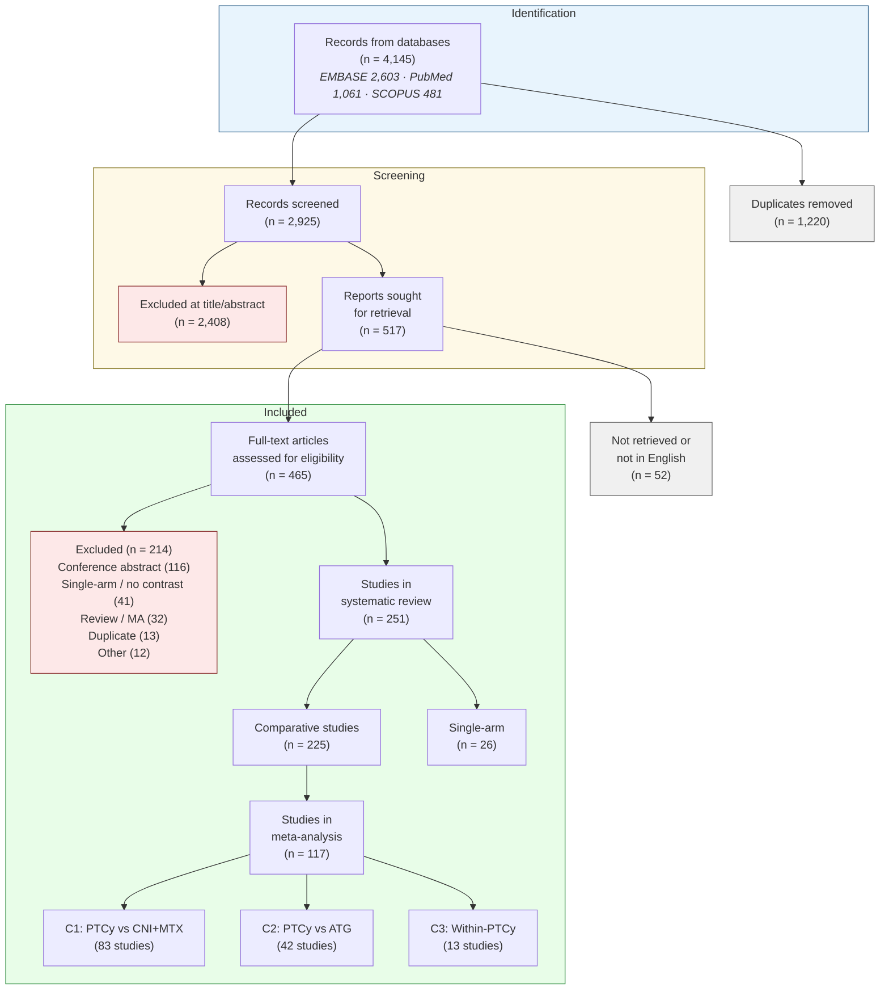

# Post-transplant cyclophosphamide as graft-versus-host disease prophylaxis after allogeneic haematopoietic stem-cell transplantation: a systematic review and Bayesian meta-analysis

*Marta Stanzani, MD, Ph.D.,^1^ Dimitrios P. Kontoyiannis M.D., Sc.D, ^2^ Russell E. Lewis, Pharm.D. ^3^*

^1^ULSS2 Treviso Health System, Treviso, Italy  
^2^Department of Infctious Diseases, Infection Control and Employee Health, The University of Texas M.D. Anderson Cancer Center, Houston, Texas, USA  
^3^Department of Molecular Medicine, University of Padova, Padova, Italy  

Correspondence to: Dr Russell Lewis, Department of Molecular Medicine, University of Padova, Via Gabelli 63, 35121 Padova, Italy — russelledward.lewis@unipd.it

## Summary

**Background**
Post-transplant cyclophosphamide (PTCy) is increasingly used for graft-versus-host disease (GVHD) prophylaxis after allogeneic haematopoietic stem-cell transplantation (allo-HSCT), but its effects on infection outcomes relative to alternative prophylaxis platforms have not been systematically quantified. We aimed to simultaneously evaluate survival, GVHD, and infection outcomes of PTCy across multiple comparator contexts.

**Methods**
In this systematic review and Bayesian meta-analysis, we searched EMBASE, PubMed, and SCOPUS from database inception to [search date] for studies comparing PTCy-based GVHD prophylaxis with alternative regimens in adult allo-HSCT recipients. We defined three pre-specified comparisons: PTCy versus calcineurin inhibitor (CNI)+methotrexate/mycophenolate (Comparison 1 [C1]); PTCy versus anti-thymocyte globulin (ATG; Comparison 2 [C2]); and within-PTCy regimen variants (Comparison 3 [C3]). The primary outcome was overall survival (OS). Secondary outcomes included non-relapse mortality (NRM), acute GVHD grade II–IV, CMV reactivation, bloodstream infection (BSI), and invasive fungal infection (IFI). We used Bayesian random-effects binomial-logistic models with a GVHD-mediation analysis (steroid exposure as mediator). This study is registered with PROSPERO, [CRD number].

**Findings**
Of 4145 records identified, 251 studies (525 arms; 177 758 patients; 14 RCTs) were included in the systematic review and 117 contributed to the meta-analysis. In C1 (83 studies), PTCy was associated with improved OS (OR 0·79 [95% CrI 0·73–0·85]), reduced acute GVHD (0·67 [0·59–0·78]), but increased CMV reactivation (1·26 [1·07–1·47]) and BSI (1·87 [1·33–2·62]). In C2 (42 studies), PTCy improved OS versus ATG (0·81 [0·74–0·90]) with no CMV excess (0·92 [0·73–1·15]). The CMV signal was steroid-independent and strengthened in post-2020 and haploidentical-dominant cohorts. GRADE certainty was LOW for survival and GVHD outcomes; VERY LOW for infection outcomes.

**Interpretation**
PTCy improves survival and reduces GVHD across comparator platforms, but increases CMV and bacterial infection risk relative to less T-cell-depleting regimens. The comparative pattern — CMV harm versus CNI-based but not versus ATG-based prophylaxis — indicates that infection risk tracks the depth of T-cell depletion across platforms, reframing PTCy-associated infections as a class effect of T-cell-depleting prophylaxis rather than a PTCy-specific limitation.

**Funding**
There was no funding source for this study.

---

## Research in Context

### Evidence before this study

We searched PubMed for systematic reviews and meta-analyses of post-transplant cyclophosphamide in allogeneic haematopoietic stem-cell transplantation published from database inception to June 1, 2026, using the terms "post-transplant cyclophosphamide" AND ("meta-analysis" OR "systematic review"). We identified seven comparative meta-analyses (Gagelmann 2019, Arcuri 2019, Arcuri 2021, Tang 2023, Luo 2024, Li 2025, Jin 2025), encompassing 6–20 studies each. All evaluated survival and GVHD outcomes; only two (Tang 2023, Li 2025) pooled any infection outcome, each with 2–4 studies per infection type. No prior meta-analysis simultaneously evaluated CMV, bacterial, and fungal infections alongside survival and GVHD. No prior study compared PTCy against both CNI-based and ATG-based comparators in a unified framework, and none has proposed a mechanistic explanation for the apparently contradictory infection findings across comparator contexts.

### Added value of this study

This systematic review and meta-analysis is, to our knowledge, the largest to date (251 studies, 177 758 patients). It is the first to systematically pool CMV, bloodstream infection, and invasive fungal infection alongside GVHD and survival within the same analytic framework. Its dual-comparator design reveals that PTCy's effect on CMV reverses direction depending on the comparator's own T-cell depletion depth — harmful versus CNI-based (OR 1·26) but null versus ATG-based (OR 0·92) — establishing a T-cell depletion hierarchy that unifies apparently contradictory findings. Bayesian mediation analysis shows that the survival benefit is only partially mediated through GVHD suppression, implying an additional direct survival contribution.

### Implications of all the available evidence

PTCy improves overall survival and reduces GVHD regardless of comparator platform. Its infection costs — elevated CMV and bacteraemia — are attributable to T-cell depletion depth and are shared with ATG-based regimens. Clinical strategies to mitigate these risks should target T-cell reconstitution (adoptive T-cell therapy, optimised letermovir prophylaxis, earlier immunosuppression tapering) rather than PTCy avoidance. Within-PTCy regimen variants show no detectable differences, supporting flexibility in dose and backbone immunosuppression selection.

---

## Introduction

Post-transplant cyclophosphamide (PTCy) has transformed the practice of allogeneic haematopoietic stem-cell transplantation (allo-HSCT) by enabling safe transplantation across HLA barriers and simplifying graft-versus-host disease (GVHD) prophylaxis.^1^ Originally developed for haploidentical transplantation,^2^ PTCy is now widely used across all donor types,^3^ and the BMT CTN 1703 randomised controlled trial (RCT) established its superiority over conventional calcineurin inhibitor (CNI)-based prophylaxis for GVHD-free, relapse-free survival.^4^

Despite this evidence, uncertainty persists regarding PTCy's effects on infection outcomes. Registry and single-centre studies have variably reported increased cytomegalovirus (CMV) reactivation,^5^ elevated bacterial bloodstream infections,^6^ and comparable or reduced fungal infections^7^ with PTCy-based regimens. These findings have been difficult to synthesise because prior meta-analyses have been restricted to single comparisons (typically haploidentical PTCy vs matched donors), limited to 6–20 studies, and have rarely included infection as a primary outcome.

The absence of a unified analytic framework spanning multiple comparator contexts has obscured a fundamental question: are infection risks attributable to PTCy itself, or to the depth of T-cell depletion inherent to any intensive GVHD prophylaxis platform? Answering this question requires simultaneous comparison of PTCy against both less depleting (CNI+methotrexate) and more depleting (anti-thymocyte globulin [ATG]) regimens.

We conducted a systematic review and Bayesian meta-analysis to simultaneously evaluate survival, GVHD, and infection outcomes of PTCy-based GVHD prophylaxis across three pre-specified comparisons, with a GVHD-mediation analysis to decompose the pathways through which PTCy influences clinical outcomes.

---

## Methods

### Search strategy and selection criteria

This systematic review and meta-analysis was conducted in accordance with PRISMA 2020 guidelines and registered with PROSPERO ([CRD number]). We searched EMBASE, PubMed, and SCOPUS from database inception to [date] for studies comparing PTCy-based GVHD prophylaxis with alternative regimens in adult (≥18 years) allo-HSCT recipients. The complete search strategy for PubMed is provided in the appendix (p XX). Reference lists of included studies and relevant reviews were hand-searched. No language restrictions were applied at the search stage; studies not available in English were excluded at full-text review.

Studies were eligible if they reported at least one pre-specified outcome with extractable event counts (numerator and denominator) for at least two arms differing in GVHD prophylaxis strategy. Conference abstracts were excluded. We defined three pre-specified comparisons: C1, PTCy (±CNI/mycophenolate mofetil [MMF]) versus CNI+methotrexate (MTX)/MMF without ATG or T-cell depletion; C2, PTCy versus ATG-based prophylaxis; C3, within-PTCy regimen variants.

Two reviewers (MS and RL) screened titles and abstracts using Coevidence platform and conducted data extraction using a structured template (appendix p XX). AI-assisted extraction (Claude Cowork, version 2026.06) was used to accelerate data extraction from PDF source documents; all AI-extracted values were manually verified against source publications. Risk of bias was assessed using ROBINS-I for observational studies and RoB 2 for RCTs. Studies sharing patient cohorts were flagged and the most comprehensive publication designated as primary for each cohort-outcome combination.

### Outcomes

The primary outcome was overall survival (OS). Secondary outcomes included non-relapse mortality (NRM), acute GVHD grade II–IV (at day +100), chronic GVHD (moderate–severe), CMV reactivation (any), bloodstream infection (BSI, any pathogen), invasive fungal infection (IFI, any), relapse-related mortality (RRM), BK virus reactivation, and infection-related mortality (IRM).

### Data analysis

We fitted Bayesian random-effects binomial-logistic regression models using brms (version 2.23.0) with an rstan backend in R (version 4.6.0). The primary model (M1) estimated the PTCy treatment effect adjusted for timepoint (early [day +100 or +180] vs late [≥1 year]) with a random intercept for study:

$$\text{events}_i \mid \text{trials}(n_i) \sim \text{Binomial}(\text{logit}^{-1}(\alpha + \beta_{\text{PTCy}} x_i + \beta_{\text{tp}} t_i + u_{s[i]}))$$

Weakly informative priors were specified: N(0, 2·5) on fixed effects, N(0, 1·5) on the intercept, and Student-t(3, 0, 1) on the between-study standard deviation (τ). Four chains of 4000 iterations (1000 warmup) were run with adapt_delta=0·95. Convergence was assessed by R̂ and effective sample size.

The GVHD-mediation model (M2) added arm-level systemic steroid exposure percentage as a covariate, providing an estimate of the PTCy effect independent of GVHD-mediated steroid burden. Attenuation of the treatment effect from M1 to M2 was interpreted as evidence of steroid-mediated confounding.

Pre-specified sensitivity analyses included restriction to post-2020 publications (letermovir era), haploidentical-dominant cohorts (≥50% haplo donors), and leave-one-out analysis. Frequentist random-effects models (restricted maximum likelihood [REML], metafor version 5.0.1) were fitted as concordance checks. Publication bias was assessed using Robust Bayesian Model-Averaging (RoBMA). Certainty of evidence was assessed using the GRADE framework adapted for observational evidence.

### Role of the funding source

There was no funding source for this study.

## Results

### Search results and study characteristics

The database search identified 4145 records (EMBASE 2603, PubMed 1061, SCOPUS 481), of which 1220 were duplicates (figure 1). After screening 2925 titles and abstracts, 517 articles were sought for full-text review; 52 could not be retrieved or were not in English. Of 465 full-text articles assessed, 214 were excluded (appendix p XX), leaving 251 studies for the systematic review. Of these, 117 studies with extractable event counts contributed to the meta-analysis across three comparisons: C1 (83 studies), C2 (42 studies), and C3 (13 studies).

The 225 comparative studies encompassed 520 arms and 177 758 patients (table 1). Most were retrospective cohorts (132 [59%]) or registry analyses (62 [28%]); 14 (6%) were RCTs. Median publication year was 2023 (IQR 2021–24), with median follow-up of 26 months (IQR 20–36). PTCy arms were predominantly haploidentical donor transplants (127 [47%]) whereas comparator arms were predominantly matched unrelated (94 [38%]) or matched sibling (54 [22%]) donor transplants.

### Risk of bias

Of 227 observational studies assessed with ROBINS-I, 150 (66%) were at moderate risk of bias and 71 (31%) at serious risk, primarily due to confounding by donor type and conditioning intensity (appendix p XX). Of 14 RCTs assessed with RoB 2, 11 had some concerns (predominantly unblinded outcome assessment), two were at high risk, and one was at low risk of bias.

### Comparison 1: PTCy versus CNI+MTX/MMF

PTCy was associated with improved OS (k=40, OR 0·79 [95% CrI 0·73–0·85]; P(OR<1)=100%; figure 2). Adjusting for steroid exposure attenuated the estimate (M2 OR 0·86 [0·77–0·96]), indicating partial GVHD-mediated confounding but a residual direct benefit. NRM showed a non-significant trend toward benefit (k=12, OR 0·88 [0·66–1·18]). Relapse-related mortality was reduced (k=38, OR 0·84 [0·76–0·93]).

Acute GVHD grade II–IV was substantially reduced (k=28, OR 0·67 [0·59–0·78]) as was moderate-to-severe chronic GVHD (k=21, OR 0·33 [0·29–0·36]).

CMV reactivation was increased (k=22, OR 1·26 [1·07–1·47]; figure 3). This effect was steroid-independent (M2 OR 1·25 [1·01–1·54]) and strengthened in post-2020 studies (k=17, OR 1·53 [1·28–1·85]) and haploidentical-dominant cohorts (k=12, OR 1·38 [1·12–1·71]). BSI was elevated (k=6, OR 1·87 [1·33–2·62]) and BK virus reactivation showed the largest infection effect (k=11, OR 2·48 [1·82–3·38]). Conversely, IFI was reduced (k=6, OR 0·43 [0·29–0·63]), though with extreme heterogeneity (τ=1·64). Infection-related mortality was modestly elevated (k=16, OR 1·35 [1·16–1·57]).

### Comparison 2: PTCy versus ATG

PTCy improved OS versus ATG (k=10, OR 0·81 [0·74–0·90]), with negligible steroid-mediated attenuation (M2 OR 0·82 [0·71–0·94]). Acute GVHD was reduced (k=9, OR 0·58 [0·44–0·77]). NRM could not be assessed (k=2). CMV reactivation was not significantly different (k=13, OR 0·92 [0·73–1·15]), contrasting with the excess seen in C1. Infection-related mortality was not increased (k=7, OR 0·90 [0·74–1·09]).

### Comparison 3: within-PTCy variants

No significant differences were detected between PTCy-based regimen variants for any outcome (OS 1·11, NRM 0·96, acute GVHD 1·00, chronic GVHD 0·67; all CrIs crossed the null; k=4–7 per outcome).

### Certainty of evidence

GRADE certainty was LOW for C1 OS, C1 acute GVHD, C1 CMV, C2 OS, and C2 acute GVHD, and VERY LOW for C1 NRM, C1 BSI, C1 IFI, C2 CMV, and C2 BSI (table 2). No outcome achieved MODERATE or HIGH certainty. The C1 CMV robustness upgrade was supported by steroid independence and consistent direction across two sensitivity analyses.

---

## Discussion

This systematic review and meta-analysis — encompassing 251 studies, 525 arms, and over 177 000 patients — is, to our knowledge, the largest and most comprehensive evaluation of PTCy-based GVHD prophylaxis to date. Its dual-comparator design and simultaneous analysis of survival, GVHD, and infection outcomes within a unified Bayesian framework enables a mechanistic interpretation that has not been possible in prior single-comparison reviews.

The survival and GVHD findings are unequivocal in direction and consistent across comparators. PTCy reduces acute GVHD grade II–IV by approximately one-third versus CNI+MTX/MMF (OR 0·67) and by more than 40% versus ATG (OR 0·58), with correspondingly large reductions in chronic GVHD. Overall survival is improved by approximately 20% in both comparisons (C1 OR 0·79; C2 OR 0·81). These findings align with and substantially extend the BMT CTN 1703 RCT,^4^ which established PTCy superiority in the matched-donor setting. The present analysis confirms that this advantage generalises across donor types, conditioning regimens, and geographic settings.

The central conceptual contribution of this analysis is the resolution of apparently contradictory infection findings into a coherent mechanistic framework. PTCy administered on days +3 and +4 post-transplant eliminates alloreactive T cells (the intended GVHD-preventive effect) but simultaneously depletes the nascent pathogen-specific T-cell repertoire (an unintended immunological cost). In C1, this T-cell depletion manifests as increased CMV reactivation (OR 1·26) and BSI (OR 1·87). Neither association is attenuated by adjusting for steroid exposure, confirming that these infection risks operate through a pathway orthogonal to the GVHD–steroid cascade. This steroid independence contrasts sharply with the NRM signal, which is entirely steroid-mediated (M2 OR 0·90, CrI crossing null), demonstrating that the GVHD-mediated and T-cell-depletion-mediated consequences of PTCy are genuinely dissociable.

The C2 analysis provides a critical test of this framework. If CMV excess were an intrinsic property of cyclophosphamide, it should persist regardless of comparator. Instead, PTCy shows no CMV excess versus ATG (C2 OR 0·92 [0·73–1·15]), consistent with the prediction that infection risk tracks the relative depth of T-cell depletion between arms. This pattern — harmful versus less-depleting, null versus more-depleting — establishes a T-cell depletion hierarchy (CNI-based < PTCy < ATG) that reframes PTCy-associated infections as a class effect of T-cell-depleting prophylaxis rather than a drug-specific limitation.

Several limitations warrant discussion. First, the evidence base is predominantly observational, and no outcome exceeded LOW certainty under GRADE assessment. Selection bias, confounding by donor type, and centre-level practice variation are inherent limitations that cannot be fully addressed by meta-regression. Second, the steroid-mediation analysis uses arm-level rather than individual-patient data, limiting causal inference. Third, infection outcome definitions varied across studies (e.g., any CMV reactivation vs clinically significant CMV infection; any positive blood culture vs ICU-requiring BSI), introducing measurement heterogeneity. Fourth, the IFI signal (OR 0·43), while statistically significant, is driven by extreme heterogeneity (τ=1·64) and probably reflects confounding by antifungal prophylaxis practices rather than a direct PTCy effect. Fifth, the C2 CMV estimate attenuated substantially from pre-Block-9 analysis (0·77→0·92) after identification of arm classification errors, highlighting the fragility of comparative estimates in observational meta-analyses.

The within-PTCy comparison (C3) found no detectable differences between regimen variants for any outcome, supporting clinical flexibility in PTCy dosing and backbone immunosuppression selection. However, statistical power was limited (k=4–7) and equivalence cannot be concluded.

These findings have direct clinical implications. For centres already using PTCy, the infection costs — while real — are quantitatively modest (CMV OR 1·26) and are shared with ATG-based regimens, which carry at least comparable T-cell depletion liability. Clinical strategies to mitigate these costs should target T-cell reconstitution (adoptive T-cell therapies, letermovir prophylaxis, earlier immunosuppression tapering) rather than PTCy avoidance. The strengthening of the CMV signal in post-2020 studies (OR 1·53), despite widespread letermovir adoption, suggests that pharmacological CMV prophylaxis alone does not fully offset the reconstitution delay. For NRM, optimising GVHD control remains the operative lever: any strategy reducing GVHD severity and attendant steroid exposure will translate into NRM benefit.

In conclusion, PTCy improves overall survival and reduces GVHD across comparator platforms. Its infection costs are attributable to the depth of T-cell depletion — a mechanistic property shared with ATG — and are best addressed through strategies targeting immune reconstitution. The present analysis provides a unified framework for interpreting the benefit–harm balance of PTCy and should inform guideline development, clinical counselling, and the design of future trials.

---

## Contributors

[RL did the searches, data extraction, risk of bias assessment, statistical analysis, and wrote the first draft of the report. XX verified the extracted data. All authors had full access to all the data in the study and had final responsibility for the decision to submit for publication. RL and XX directly accessed and verified the underlying data reported in the manuscript.]

## Declaration of interests

[We declare no competing interests. — or list as applicable]

## Data sharing

[Individual study-level data extracted for this systematic review, including the complete extraction database and analytic datasets, will be made available upon publication. The data will be accessible via [repository URL] with a signed data access agreement. The study protocol is registered with PROSPERO ([CRD number]).]

## Acknowledgments

[Source of funding. AI-assisted extraction was performed using Posit Assistant (version 2026.06, Posit PBC, Boston, MA, USA) for accelerating data extraction from PDF source documents; all AI-extracted values were manually verified against source publications.]

---

## References

[References to be numbered sequentially in Vancouver style. The reference list should comprise all studies included in the systematic review plus up to 30 others. Key references for the Introduction and Methods are indicated by superscript placeholders in the text above.]

1. [O'Donnell PV et al. Nonmyeloablative BMT with PTCy. BBMT 2002.]
2. [Luznik L et al. HLA-haploidentical BMT with PTCy. BBMT 2008.]
3. [Kanakry CG et al. PTCy for GVHD prevention. Curr Opin Hematol 2016.]
4. [Bolaños-Meade J et al. PTCy-based GVHD prophylaxis (BMT CTN 1703). NEJM 2023.]
5. [Goldsmith SR et al. PTCy and CMV infection: CIBMTR analysis. BBMT 2021.]
6. [Meyer T et al. Infections after PTCy, ATLG, and non-ATLG prophylaxis. TCT 2025.]
7. [Papanicolaou GA et al. IFI after haplo-PTCy transplantation. CID 2024.]

[Remaining references to be completed at submission.]

---

## Tables

### Table 1: Characteristics of included studies

| Characteristic | Value |
|---|---|
| **Studies** | 251 |
| Comparative (≥2 arms) | 225 |
| Single-arm descriptive | 26 |
| **Arms** | 525 |
| **Total patients** | 177 758 |
| **RCTs** | 14 (6%) |
| **Study design** | |
| Retrospective cohort | 132 (59%) |
| Registry analysis | 62 (28%) |
| Prospective cohort | 17 (8%) |
| **Publication year, median (IQR)** | 2023 (2021–24) |
| **Follow-up, months, median (IQR)** | 26 (20–36) |
| **ROBINS-I overall judgement (n=227)** | |
| Moderate | 150 (66%) |
| Serious | 71 (31%) |
| High | 6 (3%) |

| | PTCy arms (n=272) | Comparator arms (n=248) |
|---|---|---|
| **Patients per arm, median (IQR)** | 99 (46–212) | 120 (51–375) |
| **Age, years, median (IQR)*** | 52·0 (44·9–58·0) | 53·0 (43·0–57·9) |
| **Male, %*** | 57·1 (54·0–61·5) | 57·4 (53·0–61·8) |
| **Donor type (predominant)** | | |
| Haploidentical | 127 (47%) | 36 (15%) |
| MUD (10/10) | 64 (24%) | 94 (38%) |
| MMUD (9/10 or lower) | 29 (11%) | 28 (11%) |
| MSD | 29 (11%) | 54 (22%) |
| Mixed / other / NR | 23 (8%) | 36 (15%) |
| **Graft source (predominant)** | | |
| PBSC | 204 (75%) | 181 (73%) |
| BM | 31 (11%) | 11 (4%) |
| UCB | — | 18 (7%) |
| Mixed / NR | 37 (14%) | 38 (15%) |
| **Conditioning (predominant)** | | |
| RIC | 110 (40%) | 85 (34%) |
| MAC | 106 (39%) | 119 (48%) |
| NMA | 7 (3%) | 3 (1%) |
| Mixed / NR | 49 (18%) | 41 (17%) |
| **CMV R+, %*** | 74·8 (65·8–80·1) | 69·4 (59·5–81·3) |
| **Steroid exposure, %*** | 26·6 (20·0–32·7) | 34·5 (28·5–43·5) |

*Median of arm-level values; IQR reflects between-arm variability. MUD=matched unrelated donor. MMUD=mismatched unrelated donor. MSD=matched sibling donor. PBSC=peripheral blood stem cells. BM=bone marrow. UCB=umbilical cord blood. MAC=myeloablative conditioning. RIC=reduced-intensity conditioning. NMA=non-myeloablative. NR=not reported.

---

### Table 2: Bayesian meta-analysis results — all outcomes by comparison

| Outcome | Comparison | Model | k | N | OR [95% CrI] | τ | GRADE |
|---|---|---|---|---|---|---|---|
| **Overall survival** | C1 | M1 | 40 | 19 724 | 0·79 [0·73–0·85] | 0·61 | ⊕⊕◯◯ LOW |
| | C1 | M2 | 40 | 19 724 | 0·86 [0·77–0·96] | 0·58 | — |
| | C2 | M1 | 10 | 12 851 | 0·81 [0·74–0·90] | 0·51 | ⊕⊕◯◯ LOW |
| | C2 | M2 | 10 | 12 851 | 0·82 [0·71–0·94] | 0·70 | — |
| | C3 | M1 | 6 | 4746 | 1·11 [0·95–1·30] | 0·92 | — |
| **Non-relapse mortality** | C1 | M1 | 12 | 1309 | 0·88 [0·66–1·18] | 0·72 | ⊕◯◯◯ V. LOW |
| | C1 | M2 | 12 | 1309 | 0·90 [0·59–1·36] | 0·60 | — |
| | C2 | M1 | — | — | k=2, not assessed | — | — |
| **Relapse-related mortality** | C1 | M1 | 38 | 19 225 | 0·84 [0·76–0·93] | 0·45 | — |
| | C2 | M1 | 10 | 17 182 | 0·79 [0·69–0·89] | 0·16 | — |
| **Acute GVHD II–IV** | C1 | M1 | 28 | 4197 | 0·67 [0·59–0·78] | 0·68 | ⊕⊕◯◯ LOW |
| | C2 | M1 | 9 | 1099 | 0·58 [0·44–0·77] | 0·55 | ⊕⊕◯◯ LOW |
| **Chronic GVHD mod–severe** | C1 | M1 | 21 | 12 493 | 0·33 [0·29–0·36] | 0·71 | — |
| | C2 | M1 | 6 | 905 | 0·79 [0·55–1·14] | 0·89 | — |
| **CMV reactivation** | C1 | M1 | 22 | 3328 | 1·26 [1·07–1·47] | 0·75 | ⊕⊕◯◯ LOW |
| | C1 | M2 | 22 | 3328 | 1·25 [1·01–1·54] | 0·76 | — |
| | C2 | M1 | 13 | 1571 | 0·92 [0·73–1·15] | 0·64 | ⊕◯◯◯ V. LOW |
| **Bloodstream infection** | C1 | M1 | 6 | 806 | 1·87 [1·33–2·62] | 0·96 | ⊕◯◯◯ V. LOW |
| **Invasive fungal infection** | C1 | M1 | 6 | 2243 | 0·43 [0·29–0·63] | 1·64 | ⊕◯◯◯ V. LOW |
| **BK virus** | C1 | M1 | 11 | 1333 | 2·48 [1·82–3·38] | 1·06 | — |
| | C2 | M1 | 3 | 313 | 2·44 [1·40–4·26] | 0·57 | — |
| **Infection-related mortality** | C1 | M1 | 16 | 8214 | 1·35 [1·16–1·57] | 0·84 | — |
| | C2 | M1 | 7 | 13 346 | 0·90 [0·74–1·09] | 0·58 | — |

M1=primary model adjusted for timepoint. M2=steroid-mediation model. k=number of paired studies. N=total patients across all arms. τ=between-study standard deviation (posterior median). CrI=credible interval. GRADE ratings shown for pre-specified primary and secondary outcomes only. OR<1 favours PTCy for survival and GVHD outcomes; OR>1 indicates elevated risk with PTCy for infection outcomes.

---

## Figure Legends

**Figure 1: Study selection (PRISMA 2020 flow diagram)**
4145 records identified from databases (EMBASE 2603, PubMed 1061, SCOPUS 481). 1220 duplicates removed. 2925 screened; 2408 excluded at title/abstract. 517 sought for retrieval; 52 not retrieved or not in English. 465 full-text assessed; 214 excluded (appendix p XX). 251 studies included in systematic review; 117 with extractable event counts included in meta-analysis (C1: 83 studies; C2: 42 studies; C3: 13 studies).

**Figure 2: Forest plot — overall survival (Comparisons 1 and 2)**
Individual study odds ratios with 95% Wald CIs (raw per-study data) and pooled Bayesian random-effects posterior median with 95% credible interval (primary model M1) for overall survival. Panel A: C1, PTCy versus CNI+MTX/MMF (k=40, OR 0·79 [95% CrI 0·73–0·85]). Panel B: C2, PTCy versus ATG (k=10, OR 0·81 [0·74–0·90]). Events and denominators shown for PTCy and comparator groups for each study. The corresponding frequentist (REML) concordance check is provided in Appendix Figure S8a.

**Figure 3: Forest plot — CMV reactivation (Comparisons 1 and 2)**
Individual study odds ratios for CMV any-reactivation. Panel A: C1 (k=22, OR 1·26 [1·07–1·47]). Panel B: C2 (k=13, OR 0·92 [0·73–1·15]). The direction reversal between comparisons suggests a T-cell depletion depth hierarchy. Pooled estimates are Bayesian random-effects posterior medians with 95% credible intervals (primary model M1), shown with the posterior density above the pooled row. The corresponding frequentist (REML) concordance check is provided in Appendix Figure S8a.

**Figure 4: Forest plots — bacterial, fungal, and BK viral infection risk (Comparison 1)**
Individual study odds ratios (raw per-study estimates) and pooled Bayesian random-effects posterior median with 95% credible interval (primary model M1), shown with the posterior density above each pooled row. Panel A: bloodstream infection, any pathogen (k=6, OR 1·87 [1·33–2·62]). Panel B: invasive fungal infection, any (k=6, OR 0·43 [0·29–0·63]; τ=1·64, reflecting extreme heterogeneity, probably confounded by antifungal prophylaxis practice). Panel C: BK virus reactivation (k=11, OR 2·48 [1·82–3·38]), the largest infection effect observed. All three comparisons are C1 (PTCy vs CNI+MTX/MMF); insufficient studies were available to fit the corresponding C2 models for BSI and IFI.

**Appendix Figure S9a: CMV sensitivity analyses (Comparison 1)**
Point estimates and 95% CrIs for C1 CMV across three analyses: primary corpus (k=22, OR 1·26), post-2020 studies (k=17, OR 1·53), and haploidentical-dominant cohorts (k=12, OR 1·38). All estimates significantly exceed 1·0. (Relocated from the main text to the appendix.)

---

---

# Appendix

## Supplementary Materials

### Post-transplant cyclophosphamide as GVHD prophylaxis after allogeneic HSCT: a systematic review and Bayesian meta-analysis

---

### Appendix S1: Search strategy

**PubMed search strategy**

[To be completed — extract from PROSPERO protocol. Should include exact search terms, Boolean operators, MeSH headings, and date limits such that the search is reproducible.]

**Search dates:** Database inception to [final search date]

**Other sources searched:** EMBASE (Elsevier), SCOPUS, reference lists of included studies and prior systematic reviews.

---

### Appendix S2: PRISMA 2020 flow diagram

*Note: For submission, this diagram must be converted to an editable Word or PowerPoint format.*

---

### Appendix S3: Studies excluded at full-text screening (n=214)

| Exclusion reason | n |
|---|---|
| Conference abstract | 116 |
| Single-arm or no PTCy contrast | 41 |
| Review, not primary study | 21 |
| Duplicate publication | 13 |
| Systematic review or meta-analysis | 11 |
| Non-eligible population | 5 |
| Protocol or survey only | 4 |
| Other | 3 |
| **Total** | **214** |

*Full alphabetical list with author–year labels available in Table_S3_excluded_studies.csv (submitted as supplementary data file).*

---

### Appendix S4: Characteristics of included studies

*Full study-level (Table S4a, 251 rows) and arm-level (Table S4b, 525 rows) characteristics are provided as supplementary data files (Table_S4a_study_characteristics.csv and Table_S4b_arm_characteristics.csv).*

Summary statistics are presented in Table 1 of the main text and in the Appendix S4 markdown document.

---

### Appendix S5: Risk of bias assessment

**Figure S5a: ROBINS-I summary (n=227 observational studies)**

| Domain | Low | Moderate | Serious | Critical | NI |
|---|---|---|---|---|---|
| D1: Confounding | [counts] | [counts] | [counts] | [counts] | [counts] |
| D2: Selection | [counts] | [counts] | [counts] | [counts] | [counts] |
| D3: Classification | [counts] | [counts] | [counts] | [counts] | [counts] |
| D4: Deviations | [counts] | [counts] | [counts] | [counts] | [counts] |
| D5: Missing data | [counts] | [counts] | [counts] | [counts] | [counts] |
| D6: Measurement | [counts] | [counts] | [counts] | [counts] | [counts] |
| D7: Reporting | [counts] | [counts] | [counts] | [counts] | [counts] |
| **Overall** | **0** | **150** | **71** | **0** | **6** |

*NI=no information. Traffic-light figures to be generated from rob.csv.*

**Figure S5b: RoB 2 summary (n=14 RCTs)**

| Domain | Low | Some concerns | High |
|---|---|---|---|
| D1: Randomisation | [counts] | [counts] | [counts] |
| D2: Deviations | [counts] | [counts] | [counts] |
| D3: Missing data | [counts] | [counts] | [counts] |
| D4: Measurement | [counts] | [counts] | [counts] |
| D5: Reporting | [counts] | [counts] | [counts] |
| **Overall** | **1** | **11** | **2** |

*Full justification narratives available in rob.csv (submitted as supplementary data file).*

---

### Appendix S6: Model specification and priors

**Primary model (M1):**

$$\text{events}_i \mid \text{trials}(n_i) \sim \text{Binomial}(\text{logit}^{-1}(\alpha + \beta_{\text{PTCy}} x_i + \beta_{\text{tp}} t_i + u_{s[i]}))$$

$$u_s \sim N(0, \tau^2)$$

Where $$x_i$$ is a binary indicator for PTCy arm, $$t_i$$ is a binary indicator for early timepoint (day +100 or +180 vs ≥1 year), and $$u_s$$ is a random intercept for study.

**GVHD-mediation model (M2):**

$$\text{logit}(p_i) = \alpha + \beta_{\text{PTCy}} x_i + \beta_{\text{tp}} t_i + \beta_{\text{steroid}} s_i + u_{s[i]}$$

Where $$s_i$$ is the centred arm-level systemic steroid exposure percentage. Complete-case analysis was used for M2 (arms with missing steroid data excluded).

**Priors:**

| Parameter | Prior |
|---|---|
| Fixed effects (β) | N(0, 2·5) |
| Intercept (α) | N(0, 1·5) |
| Between-study SD (τ) | Student-t(3, 0, 1) |

**MCMC settings:** 4 chains × 4000 iterations (1000 warmup), adapt_delta = 0·95. Convergence assessed by R̂ < 1·01 and bulk ESS > 400.

**Software:** R 4.6.0, brms 2.23.0, rstan backend, metafor 5.0.1 (frequentist checks).

**Timepoint selection:** Hierarchical preference ordering applied per outcome (e.g., OS: 1-year > 2-year > end-of-follow-up). The `tp_early` covariate adjusts for residual timepoint heterogeneity.

---

### Appendix S7: MCMC diagnostics

*Trace plots, R̂ values, and effective sample sizes for all 19 primary models are available on the study website at [URL]. All models achieved R̂ < 1·01 and bulk ESS > 1000 for key parameters (b_ptcy_binary, sd_study_id__Intercept).*

---

### Appendix S8: Forest plots

*Individual study forest plots for all outcomes and comparisons are available on the study website at [URL] and as supplementary figures submitted with this manuscript. Each plot shows individual study ORs with 95% CIs (frequentist REML), pooled estimate, I², τ, and Q-test p-value.*

---

### Appendix S9: Sensitivity analyses

**Table S9a: CMV sensitivity models (Comparison 1)**

| Analysis | k | OR [95% CrI] | τ | P(OR>1) |
|---|---|---|---|---|
| Primary | 22 | 1·26 [1·07–1·47] | 0·75 | >99·9% |
| Post-2020 only | 17 | 1·53 [1·28–1·85] | 0·83 | >99·9% |
| Haplo ≥50% only | 12 | 1·38 [1·12–1·71] | 0·69 | 99·9% |

**Table S9b: IFI leave-one-out analysis (Comparison 1, frequentist REML)**

| Excluded study | OR [95% CI] | τ | I² |
|---|---|---|---|
| None (full corpus, k=6) | 0·60 [0·21–1·74] | 1·11 | 80·5% |
| Moiseev IS 2016 | 0·81 [0·25–2·69] | 1·12 | 78·7% |
| Guo W 2026 | 0·53 [0·15–1·82] | 1·21 | 83·2% |
| **Haebe S 2023** | **0·42 [0·17–1·03]** | **0·82** | **72·8%** |
| Liu YC 2025 | 0·56 [0·14–2·17] | 1·31 | 84·7% |
| Yanada M 2026 | 0·67 [0·20–2·22] | 1·22 | 82·4% |
| Pirogova OV 2016 | 0·82 [0·25–2·68] | 1·10 | 77·5% |

Haebe S 2023 is the dominant heterogeneity contributor (τ drops from 1·11 to 0·82 on exclusion).

**Table S9c: M1 vs M2 mediation summary**

| Outcome | M1 OR | M2 OR | % log-OR attenuation | Interpretation |
|---|---|---|---|---|
| C1 OS | 0·79 | 0·86 | 27% | Partial mediation |
| C1 NRM | 0·88 | 0·90 | Indeterminate | CrI too wide to distinguish |
| C1 CMV | 1·26 | 1·25 | ~0% | Steroid-independent |
| C2 OS | 0·81 | 0·82 | ~5% | Minimal mediation |

**Table S9d: Frequentist concordance (metafor REML)**

*Full frequentist results for all models are provided in freq_results.csv (supplementary data file). Direction was concordant between Bayesian and frequentist estimates for all outcomes. Notable framework-specific differences: C1 BSI (Bayesian OR 1·87 vs frequentist 1·29 [0·61–2·73]) and C1 IFI (Bayesian OR 0·43 vs frequentist 0·60 [0·21–1·74]), both reflecting the influence of informative priors at small k.*

---

### Appendix S10: Publication bias assessment

*RoBMA (Robust Bayesian Model-Averaging) models were fitted for all outcomes with k ≥ 6. Results are available in robma_*.rds files. Full interpretation is pending and will be completed prior to final submission.*

---

### Appendix S11: GRADE certainty-of-evidence profiles

*Full GRADE evidence profiles with domain-level ratings and rationale are provided in GRADE_certainty_assessment_combined_post_block9.md (supplementary data file). Summary ratings are shown in Table 2 of the main text.*

| Outcome | Comparison | Starting | RoB | Inconsistency | Indirectness | Imprecision | Pub. bias | Upgrade | Final |
|---|---|---|---|---|---|---|---|---|---|
| OS | C1 | LOW | 0 | −1 | 0 | 0 | 0 | 0 | LOW |
| OS | C2 | LOW | 0 | −1 | 0 | 0 | 0 | +1† | LOW |
| NRM | C1 | LOW | −1 | 0 | 0 | −1 | 0 | 0 | V. LOW |
| aGVHD | C1 | LOW | 0 | −1 | 0 | 0 | 0 | +1‡ | LOW |
| aGVHD | C2 | LOW | 0 | −1 | 0 | 0 | 0 | +1‡ | LOW |
| CMV | C1 | LOW | 0 | −1 | 0 | 0 | 0 | +1§ | LOW |
| CMV | C2 | LOW | 0 | −1 | 0 | −1 | 0 | +1¶ | V. LOW |
| BSI | C1 | LOW | −1 | −1 | 0 | −1 | 0 | 0 | V. LOW |
| IFI | C1 | LOW | 0 | −2 | −1 | −1 | 0 | +1|| | V. LOW |

†Cross-comparison coherence with C1. ‡Bias direction opposes observed effect (GVHD under-diagnosis in PTCy arms). §Robustness: steroid independence + consistent direction across post-2020 (OR 1·53) and haplo (OR 1·38) subsets. ¶Partial cross-comparison coherence. ||Large magnitude (OR 0·43 ≤ 0·50 threshold).

---

### Appendix S12: Cohort overlap map

*[To be completed. Table showing which studies share patient cohorts, with the primary_for_cohort designation for each outcome.]*

---

### Appendix S13: PROSPERO registration

*The study protocol was registered with PROSPERO ([CRD number]) prior to data extraction. Protocol amendments: (1) Bayesian rather than frequentist primary analysis framework; (2) addition of BK virus, infection-related mortality, and relapse-related mortality as secondary outcomes; (3) addition of the steroid-mediation (M2) model.*

---

### Appendix S14: PRISMA 2020 checklist

*[To be completed prior to submission. A completed PRISMA 2020 checklist with page/section references for each item will be submitted alongside the manuscript.]*

---

*End of manuscript and supplementary materials.*
