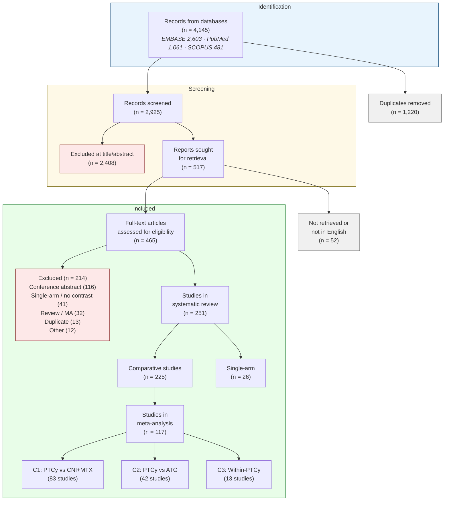

# PRISMA 2020 Flow Diagram — Data Reference
*Generated: 2026-06-19*

---

## Identification

| Source | Records |
|---|---|
| EMBASE | 2,603 |
| PubMed | 1,061 |
| SCOPUS | 481 |
| **Total from databases** | **4,145** |

---

## Deduplication

| Step | n |
|---|---|
| Duplicate references removed (Coevidence) | 1,220 |
| **Records after deduplication** | **2,925** |

---

## Title/Abstract Screening (Coevidence)

| Step | n |
|---|---|
| Records screened | 2,925 |
| Records excluded at title/abstract | 2,408 |
| **Records passing screening** | **517** |

---

## Full-Text Assessment

| Step | n |
|---|---|
| Full-text articles sought for retrieval | 517 |
| Reports not retrieved or not in English | 52 |
| **Full-text articles assessed for eligibility** | **465** |

---

## Full-Text Exclusions (n = 214)

| Exclusion reason | n |
|---|---|
| Conference abstract | 116 |
| Single-arm or no PTCy contrast | 41 |
| Review, not primary study | 21 |
| Duplicate publication | 13 |
| Systematic review or meta-analysis | 11 |
| Non-eligible population | 5 |
| Protocol or survey only | 4 |
| Other | 3 |
| **Total excluded** | **214** |

Full list: `Appendix_S3_excluded_studies.md` / `Table_S3_excluded_studies.csv`

---

## Included

| Category | n |
|---|---|
| **Studies in systematic review** | **251** |
| Retrospective cohort | 132 |
| Registry analysis | 62 |
| Single-arm descriptive | 26 |
| Prospective cohort | 17 |
| Randomised controlled trial | 14 |

| | n |
|---|---|
| Comparative studies (≥2 arms) | 225 |
| Single-arm descriptive (no comparator) | 26 |

---

## Meta-Analysis (n = 117 unique studies)

| Comparison | Definition | Studies | Arms |
|---|---|---|---|
| C1 | PTCy vs CNI+MTX/MMF (no ATG/TCD) | 83 | 313 |
| C2 | PTCy vs ATG-based | 42 | 109 |
| C3 | Within-PTCy regimen variants | 13 | 68 |

Studies may contribute to multiple comparisons (sum = 138 > 117 unique).

Gap (225 comparative → 117 in meta-analysis): Bayesian binomial-logistic
models require extractable event counts. Studies reporting only KM curves
or cumulative incidence without numerator/denominator were included in the
review but not the meta-analysis.

---

## PRISMA 2020 Diagram (Mermaid)

---

## Checklist for Submission

- [x] Database totals populated (4,145 across 3 databases)
- [x] Deduplication count (1,220 removed → 2,925 screened)
- [x] Title/abstract screening (2,408 excluded)
- [x] 52-paper gap resolved (not obtained or not in English)
- [ ] Add search date cutoff
- [ ] Add registry/trial-registry sources if applicable
- [ ] Convert mermaid diagram to editable format (Word/PowerPoint) for Lancet
- [ ] Cross-reference with PROSPERO protocol for consistency
