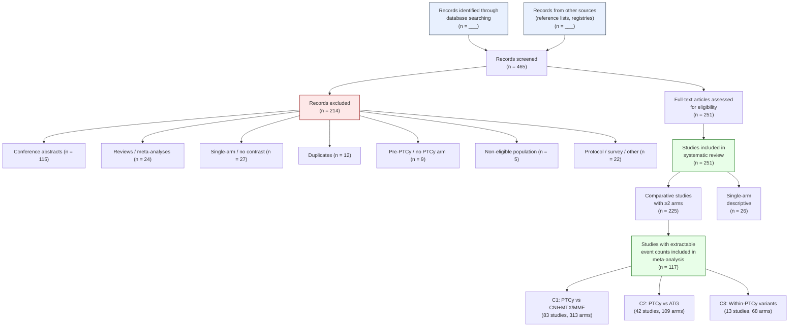

# Supplementary Materials — Draft Outline
### PTCy vs Standard GVHD Prophylaxis After Allogeneic HSCT: A Systematic Review and Meta-Analysis
*Prepared: 2026-06-19*

---

## Lancet Haematology Appendix Requirements

The [metaguidelines.pdf](../metaguidelines.pdf) specifies three mandatory appendix items:

1. ✅ Full search terms for one database → **Appendix S1**
2. ✅ Risk of bias assessments (figure or table) → **Appendix S5**
3. ✅ List of studies excluded at full-text screening, with brief reasons → **Appendix S3**

The outline below extends beyond these minimums to cover what reviewers will
expect for a Bayesian meta-analysis of 251 studies across three comparisons.

---

## Appendix Structure

### S1. Search Strategy
**Status: needs drafting from PROSPERO protocol**

- Full electronic search strategy for **PubMed/MEDLINE** (reproducing exact terms, Boolean operators, date limits)
- Date of search (final cutoff)
- Other databases searched (Cochrane CENTRAL, EMBASE, Web of Science, etc.)
- Additional sources: trial registries (ClinicalTrials.gov, EU-CTR), reference lists of included studies, grey literature
- Note on AI-assisted extraction (Lancet requires disclosure: tool name, version, how used, prompts)

*Source: `PTCy_PROSPERO_Protocol_Final.docx` — search strategy section*

### S2. PRISMA 2020 Flow Diagram
**Status: ready to generate (data compiled below)**

```
Identification
  Records identified through database search: [from PROSPERO]
  Records from other sources (reference lists, registries): [from PROSPERO]
  Total records: 465

Screening
  Records screened (title/abstract): 465
  Records excluded: 214
    Conference abstracts: 115
    Reviews / meta-analyses: 24
    Single-arm / no PTCy contrast: 27
    Duplicates: 12
    Pre-PTCy era: 9
    Non-eligible population: 5
    Protocol only / survey / other: 22

Eligibility
  Full-text articles assessed: 251

Included
  Studies in systematic review: 251
    ├─ Comparative studies (≥2 arms): 225
    └─ Single-arm descriptive: 26
  Studies in meta-analysis: 117
    ├─ C1 (PTCy vs CNI+MTX/MMF): 83 studies
    ├─ C2 (PTCy vs ATG): 42 studies
    └─ C3 (within-PTCy variants): 13 studies
```

**PRISMA 2020 note:** The gap between 225 comparative studies and 117 in the
meta-analysis is because the Bayesian models require actual event counts
(not cumulative incidence percentages). Studies reporting only Kaplan-Meier
estimates without extractable numerator/denominator were included in the
systematic review but could not contribute to the binomial-logistic models.

*Source: `PTCy_MA_extraction_template_v1.2_excluded_papers.json` (214 excluded); `02_extraction/studies.csv` (251 included)*

### S3. List of Excluded Studies
**Status: ready to generate**

Table with columns:
| First author (year) | Reason for exclusion |

214 entries, sorted alphabetically. Exclusion reasons consolidated into
PRISMA-standard categories:
- Conference abstract (n = 115)
- Narrative/systematic review, not primary study (n = 24)
- Single-arm descriptive, no PTCy vs comparator contrast (n = 27)
- Duplicate publication of included study (n = 12)
- No PTCy arm / pre-PTCy era (n = 9)
- Non-eligible population (n = 5)
- Protocol or survey only (n = 4)
- Other (n = 18)

*Source: `PTCy_MA_extraction_template_v1.2_excluded_papers.json`*

### S4. Characteristics of Included Studies
**Status: needs assembly from existing data**

**Table S4a: Study-level characteristics** (251 rows)
| First author | Year | Country | Design | Multi-centre | N patients | Enrollment period | Median follow-up (mo) | Cohort ID | Primary for cohort |

**Table S4b: Arm-level characteristics** (525 rows, or summary of key columns)
| Study | Arm label | Role | N | Donor type (% haplo/MUD/MRD) | Conditioning (% MAC/RIC) | Disease (% AML/ALL/MDS/other) | GVHD prophylaxis regimen | Comparison eligibility (C1/C2/C3) |

*Source: `02_extraction/studies.csv`, `02_extraction/arms.csv`*

### S5. Risk of Bias Assessment
**Status: ready to generate**

**Figure S5a: Risk of bias summary — ROBINS-I** (n = 227 observational studies)
Traffic-light plot showing domain-level judgements (D1–D7) and overall
judgement for each study.

- D1: Bias due to confounding
- D2: Bias in selection of participants
- D3: Bias in classification of interventions
- D4: Bias due to deviations from intended interventions
- D5: Bias due to missing data
- D6: Bias in measurement of outcomes
- D7: Bias in selection of reported result
- Overall: 150 moderate, 71 serious, 6 high

**Figure S5b: Risk of bias summary — RoB 2** (n = 14 RCTs)
Traffic-light plot for 14 RCTs. Overall: 2 low, 1 moderate, 11 some concerns.

**Table S5c: ROB justification narratives** (241 rows)
Full justification text for each study assessment.

*Source: `02_extraction/rob.csv` (241 assessments)*

### S6. Model Specification and Priors
**Status: ready to draft from existing documentation**

- **M1 formula:** `events_n | trials(denom_n) ~ ptcy_binary + tp_early + (1|study_id)`
- **M2 formula:** adds `steroid_pct_c` (centred arm-level systemic steroid exposure %)
- **Priors:**
  - Treatment effect β: N(0, 2.5) — weakly informative
  - Timepoint covariate: N(0, 2.5)
  - Intercept: N(0, 1.5) — covers baseline event rates ~5–95%
  - Between-study SD (τ): Student-t(3, 0, 1) — weakly informative half-t
- **MCMC settings:** 4 chains × 4,000 iterations (1,000 warmup), adapt_delta = 0.95
- **Software:** R 4.6.0, brms 2.23.0, rstan backend
- **Timepoint selection strategy:** hierarchical preference (e.g., OS: 1yr > 2yr > EoF)
- **Event count requirement:** only studies with extractable event counts (no back-calculation from cumulative incidence)
- **Prior sensitivity rationale** with comparison to pre-Block-9 priors (MANIFEST.md)

*Source: `refit_block9.R`, `03_models/MANIFEST.md`*

### S7. MCMC Diagnostics
**Status: partially available (website diagnostics page)**

- Table of R̂, bulk ESS, tail ESS for all 19 models
- Trace plots for key parameters (b_ptcy_binary, sd_study_id__Intercept) for each model
- Posterior predictive checks (observed vs replicated event proportions)

*Source: `05_website/diagnostics.qmd`, model objects in `03_models/post_block9/`*

### S8. Forest Plots (All Outcomes × All Comparisons)
**Status: ready to generate (website forest plots page renders these)**

Study-level forest plots showing individual study ORs with 95% CIs
(frequentist REML) for each outcome × comparison combination:

- C1: OS, NRM, aGVHD, cGVHD (mod-severe), CMV, BSI, IFI, RRM, BK virus, IRM (10 plots)
- C2: OS, NRM, aGVHD, CMV, RRM, BK virus, IRM (7 plots)
- C3: OS, NRM, aGVHD, cGVHD (4 plots)

Each plot includes events/N for PTCy and comparator groups per study,
pooled RE estimate, I², τ, and heterogeneity Q-test p-value.

*Source: `05_website/forest-plots.qmd`, `03_models/post_block9/data_*.csv`*

### S9. Sensitivity and Subgroup Analyses
**Status: partially available**

**Table S9a: Pre- vs post-Block-9 comparison**
All outcomes showing OR shift, k change, and CrI overlap assessment.

**Table S9b: M1 vs M2 mediation summary**
For each outcome with M2 model: M1 OR, M2 OR, % attenuation, interpretation.

**Table S9c: C2 sensitivity — expanded arm inclusion**
Primary vs expanded-arm classification (reclassifying PTCy+ATG combination arms).

**Table S9d: CMV sensitivity models** (if re-fitted)
Post-2020 subset, haplo-only subset, M3 (aGVHD-adjusted).

**Table S9e: Frequentist sanity checks**
Parallel frequentist (metafor REML) results for all Bayesian models.

*Source: `03_models/post_block9/pre_vs_post_comparison.csv`, `freq_results.csv`, website sensitivity page*

### S10. Publication Bias Assessment
**Status: models exist, interpretation pending**

**Table S10a: Egger's test results** (for outcomes with k ≥ 10)
**Figure S10b: Funnel plots** (for outcomes with k ≥ 10)
**Table S10c: RoBMA results** — Bayesian model-averaged publication bias assessment

RoBMA models fitted for: C1 OS, C1 aGVHD, C1 CMV, C1 NRM, C1 BSI, C1 IFI,
C2 OS, C2 aGVHD, C2 CMV.

*Source: `03_models/post_block9/robma_*.rds`, `pub_bias_egger.rds`, `pub_bias_trimfill.rds`*

### S11. GRADE Certainty-of-Evidence Assessment
**Status: drafted (post-Block-9 update complete)**

Full GRADE evidence profile tables for:
- C1: OS, NRM, aGVHD, CMV, BSI, IFI (6 outcomes)
- C2: OS, NRM (not assessable), aGVHD, CMV, BSI (5 outcomes)

Including domain-level ratings, rationale for downgrades/upgrades, and
cross-comparison coherence assessment.

*Source: `04_writing/GRADE_certainty_assessment_combined_post_block9.md`*

### S12. Cohort Overlap Map
**Status: needs formatting**

Table showing the cohort structure: which studies share patient populations
(e.g., EBMT ALWP cohort 1024 with 15+ publications, CIBMTR cohorts, JSTCT
registry). Demonstrates how the `primary_for_cohort` flag prevents
double-counting.

*Source: `02_extraction/cohorts.csv`, `02_extraction/studies.csv` (cohort_id, cohort_overlap_status columns)*

### S13. PROSPERO Registration
**Status: exists**

Protocol registration details and any deviations from registered protocol.

*Source: `PTCy_PROSPERO_Protocol_Final.docx`*

### S14. PRISMA 2020 Checklist
**Status: needs completion**

Completed PRISMA 2020 checklist with page/section references for each item.

---

## PRISMA 2020 Flow Diagram (Draft)



### Notes on PRISMA flow

1. **The 465 → 251 + 214 split** is at the full-text screening level, not
   title/abstract, because the corpus was assembled from a curated Paperpile
   library (not a raw database search). The PRISMA diagram should clarify this
   in the Identification box.

2. **251 → 117 in meta-analysis:** The gap arises because (a) 26 are single-arm
   descriptive without a comparator, and (b) among the remaining 225 comparative
   studies, many report outcomes only as Kaplan-Meier curves or cumulative
   incidence without extractable event counts. The Bayesian binomial-logistic
   models require actual numerators and denominators.

3. **Study counts across comparisons overlap:** A study may contribute to C1 and
   C2 if it has arms eligible for both comparisons (e.g., a 3-arm study with
   PTCy, CNI+MTX, and ATG arms). The 83 + 42 + 13 = 138 sum exceeds 117
   unique studies for this reason.

4. **The Lancet guidelines require editable format** (Word or PowerPoint) for
   the flow diagram. The mermaid diagram above is a draft; the final version
   should be re-created in an editable format.

---

## Lancet-Specific Formatting Notes

From the guidelines:

- **Main text:** 3,500 words (references flexible but only included studies + up to 30 others)
- **Summary:** 300 words max, structured (Background / Methods / Findings / Interpretation / Funding)
- **"Research in context" panel** required: Evidence before this study / Added value / Implications
- **Forest plots:** must include events/N for both groups; do not log-transform x-axis if effect not calculated that way
- **AI disclosure required:** describe tool name, version, how used, and prompts if applicable
- **Tables:** in Word (not Excel); use % symbol alongside percentages
- **Figures:** editable format (.eps, .pdf); not rasterised images
- **References:** Vancouver superscript style; ≤6 authors list all, ≥7 give first 3 + et al

---

## Priority Order for Drafting

1. **S2: PRISMA flow diagram** — needed for Results first paragraph; populate database search numbers from PROSPERO protocol
2. **S1: Search strategy** — extract from PROSPERO protocol
3. **S3: Excluded studies list** — auto-generate from JSON
4. **S5: Risk of bias figures** — generate traffic-light plots from rob.csv
5. **S4: Study characteristics tables** — assemble from studies.csv + arms.csv
6. **S6: Model specification** — adapt from MANIFEST.md and refit_block9.R
7. **S8: Forest plots** — already rendered on website; export as editable PDFs
8. **S9–S10: Sensitivity + publication bias** — assemble from existing results
9. **S11: GRADE tables** — adapt from post-Block-9 GRADE document
10. **S12–S14: Cohort map, PROSPERO, PRISMA checklist** — formatting tasks
